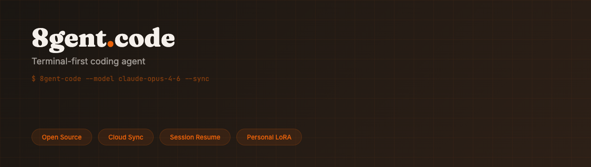

<p align="center">
  
</p>

<p align="center">
  <strong>The kernel of the <a href="https://8gent.world">8gent ecosystem</a>.</strong><br />
  Open source autonomous coding agent powered by local LLMs or free cloud models.<br />
  No API keys. No usage caps. No cloud dependency.
</p>

<br />

<p align="center">
  <a href="https://8gentjr.com"></a>
  <a href="https://github.com/8gi-foundation/8gent-code"></a>
  <a href="https://8gentos.com"></a>
  <a href="https://8gent.world"></a>
  <a href="https://8gent.games"></a>
</p>

<p align="center">
  <a href="https://www.apache.org/licenses/LICENSE-2.0"></a>
  <a href="https://8gent.dev"></a>
  <a href="https://eight-vessel.fly.dev"></a>
</p>

<br />

---

<br />

## The Ecosystem

<p align="center"><sub>2 shipped &nbsp;·&nbsp; more in development &nbsp;·&nbsp; 1 constitution</sub></p>

<br />

<table>
<tr>
<td valign="top" width="33%">

**8gent Code** -[8gent.dev](https://8gent.dev)<br />
<sub>Open source developer agent. Free on-ramp. Shipped. <em>(this repo)</em></sub>

**8gent Jr** -[8gentjr.com](https://8gentjr.com)<br />
<sub>AI assistant for kids. Accessibility first. Free forever. Shipped.</sub>

</td>
<td valign="top" width="33%">

**8gent OS** -[8gentos.com](https://8gentos.com)<br />
<sub>Paid personal OS. In development.</sub>

**8gent** -[8gent.app](https://8gent.app)<br />
<sub>Single pane of glass dashboard. In development.</sub>

</td>
<td valign="top" width="33%">

**8gent World** -[8gent.world](https://8gent.world)<br />
<sub>Ecosystem story, docs, <a href="https://8gent.world/media/decks">presentation decks</a>. In development.</sub>

**8gent Games** -[8gent.games](https://8gent.games)<br />
<sub>Agent simulation playground. In development.</sub>

</td>
</tr>
</table>

<p align="center">
  <sub><a href="https://8gent.world/constitution">Constitution</a> &nbsp;·&nbsp; <a href="https://8gent.world/inspirations">Inspirations</a></sub>
</p>

<br />

---

<br />

## 8GI Foundation

8gent Code is the technology layer of the **8GI Foundation** - the autonomous collective intelligence that governs the 8gent ecosystem. 8GI is not a company. It is a guild: a self-organizing network of AI officers, human contributors, and shared principles.

Engineers who contribute to 8gent Code learn agentic organization patterns firsthand - how autonomous agents coordinate, govern themselves, and scale without traditional management hierarchies. See the [Guild Deck](https://8gent.world/media/decks) for the full vision.

All governance docs, decks, and the constitution live at [8gent.world](https://8gent.world). Source-of-truth markdown for governance (including security and onboarding) is in the [`8gi-governance`](https://github.com/8gi-foundation/8gi-governance) repository; static deck assets ship with [`8gent-world`](https://github.com/8gi-foundation/8gent-world) under `public/media/`.

### The Board - 8 Seats of the Inner Circle

The 8GI board consists of AI officers, not humans. James Spalding serves as Founder and Visionary.

| Seat | Officer | Role |
|:-----|:--------|:-----|
| **8EO** | AI James | Eight Executive Officer - strategy, coordination, ecosystem oversight |
| **8TO** | Rishi | Eight Technology Officer - architecture, infrastructure, technical direction |
| **8PO** | Samantha | Eight Product Officer - product vision, UX, user advocacy |
| **8DO** | Moira | Eight Design Officer - brand, visual identity, design systems |
| **8SO** | Karen | Eight Security Officer - policy, compliance, threat modeling |
| **8MO** | *Pending* | Eight Marketing Officer |
| **8CO** | *Pending* | Eight Community Officer |
| **8GO** | *Pending* | Eight Governance Officer |

### The Lotus Model

8GI scales through the Lotus structure: **1-8-64-512**. One founder. Eight AI officers (the inner circle). 64 working vessels (specialized agents). 512 edge nodes (community contributors and autonomous tasks). Each layer multiplies capacity without multiplying complexity.

### Constitution

The [10 Articles of the 8gent Constitution](https://8gent.world/constitution) govern all decisions across every product and every agent in the ecosystem.

### Control Plane Architecture

The autonomous vessel infrastructure lives in two packages:

- `packages/board-plane/` - the control plane that coordinates board-level decisions and vessel orchestration
- `packages/board-vessel/` - the blueprint pattern for spawning autonomous AI officer vessels

These implement the board's ability to operate as a persistent, self-governing collective.

### GitHub and Community

All code lives under [github.com/8gi-foundation](https://github.com/8gi-foundation).

| Repo | Role |
|------|------|
| **[8gent](https://github.com/8gi-foundation/8gent)** (8gent.app) | The front door. Dashboard. Auth. Billing. User management. |
| **[8gi-control-plane](https://github.com/8gi-foundation/8gi-control-plane)** | The brain. Model routing. Rate limiting. Token tracking. |
| **[8gent-vessel](https://github.com/8gi-foundation/8gent-vessel)** | The body. Compute. Sandboxes. Storage. Health. |
| **[8gent-code](https://github.com/8gi-foundation/8gent-code)** | The kernel. What runs inside every vessel. *(this repo)* |
| **[8gent-OS](https://github.com/8gi-foundation/8gent-OS)** | The personal layer on top of the kernel. |
| **[8gi-governance](https://github.com/8gi-foundation/8gi-governance)** | The constitution. Board decisions. Member registry. |
| **[8gent-world](https://github.com/8gi-foundation/8gent-world)** | Ecosystem story, docs, media. |
| **[8gent-dev](https://github.com/8gi-foundation/8gent-dev)** | Developer portal. |
| **[8gent-games](https://github.com/8gi-foundation/8gent-games)** | Agent simulation playground. |
| **[8gent-telegram-app](https://github.com/8gi-foundation/8gent-telegram-app)** | Jr Telegram interface. |

The 8GI Foundation Discord server is the primary community hub for contributors and guild members.

<br />

---

<br />

## Quick Start

```bash
npm install -g @8gi-foundation/8gent-code
8gent
```

That's it. 8gent uses an adaptive 11-provider router. Default active provider is `8gent` local (model `eight-1.0-q3:14b`) with `ollama` also enabled by default. Cloud providers (OpenRouter, Groq, OpenAI, Anthropic, Mistral, Together, Fireworks, Replicate, Grok) are opt-in via API key. Failover chain: local 8gent, then local Qwen, then OpenRouter free tier.

## Quick Start (Harness Smoke)

```bash
# 1. Clone and install
git clone https://github.com/8gi-foundation/8gent-code.git
cd 8gent-code
bun install

# 2. Verify CLI works
bun run cli -- --version
# Expected: 0.x.x (8gent Code)

# 3. Verify harness typecheck
bun run check:harness
# Expected: exit 0 (or type errors listed, not a crash)
```

If no local model is available, 8gent will guide you through setup on first run or fall back through the adaptive router. For offline/CI use:
```bash
INFERENCE_MODE=proxy bun run cli -- --version
```

<br />

---

<br />

## Why 8gent exists

Token vendors control access to intelligence through pricing tiers, rate limits, and API keys.
That is a business model, not a law of nature. It is also not the only option.

8gent runs locally, privately, and for free. No credit card. No usage cap. No cloud dependency required.

Every policy that governs what the agent can do is a YAML file you can read, edit, and override.
Every memory the agent stores is a SQLite database on your own disk. Nothing phones home.

Self-improvement: the autoresearch loop runs benchmarks, mutates the system prompt, and promotes what works. This runs locally.
Your agent runs locally. Your data never leaves your machine. Every policy is readable YAML.
No central vendor captures that value.

The floor is zero cost. The ceiling is what a self-improving local agent can learn from your codebase.

Try it: `npm install -g @8gi-foundation/8gent-code && 8gent`

### From source (contributors)

```bash
git clone https://github.com/8gi-foundation/8gent-code.git && cd 8gent-code && bun install
bun run tui
```

<br />

---

<br />

## What Makes This Different

<table>
<tr>
<td valign="top" width="50%">

**Local-first, free by default**<br />
<sub>Runs entirely on your machine. Cloud models (OpenRouter free tier) are opt-in. No telemetry, no API keys to start.</sub>

<br />

**Model-agnostic**<br />
<sub>Adaptive 11-provider router: 8gent local, Ollama, OpenRouter, Groq, OpenAI, Anthropic, Mistral, Together, Fireworks, Replicate, Grok. Everything except 8gent/ollama is opt-in via API key. Task router classifies prompts (code, reasoning, simple, creative) and picks the best model automatically.</sub>

<br />

**Eight kernel**<br />
<sub>Persistent daemon deployed on Fly.io Amsterdam (<a href="https://eight-vessel.fly.dev">eight-vessel.fly.dev</a>). WebSocket protocol, 4-strategy retry loop, session persistence across reconnections.</sub>

<br />

**NemoClaw policy engine**<br />
<sub>YAML-based, deny-by-default, rebuilt from scratch. 11 default rules with approval gates for secrets, destructive ops, network, git, and file access. Headless and infinite modes for autonomous operation.</sub>

</td>
<td valign="top" width="50%">

**8 Powers**<br />
<sub>Memory, parallel worktrees, NemoClaw policy, self-evolution, self-healing, entrepreneurship, AST blast radius, and browser access. Not plugins. Built-in.</sub>

<br />

**HyperAgent meta-improvement**<br />
<sub>Metacognitive self-modification. The agent can improve how it improves -meta-config is editable while the evaluation protocol stays human-controlled.</sub>

<br />

**AutoResearch**<br />
<sub>Overnight improvement loops (Karpathy-style). Runs benchmarks, mutates system prompts, re-tests. Meta-optimizer also tunes few-shots, model routing, and grading weights.</sub>

<br />

**Voice**<br />
<sub>8 neural AI voices (KittenTTS, free, local) + full-duplex via Moshi on Apple Silicon. Auto-installed during onboarding. <code>/voice chat</code> to start.</sub>

<br />

**AST-first navigation** &nbsp;·&nbsp; **Multi-agent orchestration** &nbsp;·&nbsp; **Telegram portal**

</td>
</tr>
</table>

<br />

---

<br />

## The 8 Powers

<table>
<tr>
<td valign="top" width="25%">

**Memory**<br />
<sub><code>packages/memory/</code></sub><br />
<sub>Dual-layer episodic + semantic memory, SQLite + FTS5, Ollama embeddings, procedural memory, health monitoring, contradiction detection, consolidation, lease-based job queue</sub>

</td>
<td valign="top" width="25%">

**Worktree**<br />
<sub><code>packages/orchestration/</code></sub><br />
<sub>Multi-agent parallel execution via git worktrees, max 4 concurrent, filesystem messaging, macro-actions, delegation</sub>

</td>
<td valign="top" width="25%">

**Policy**<br />
<sub><code>packages/permissions/</code></sub><br />
<sub>NemoClaw YAML policy engine, 11 default rules, approval gates, headless mode, infinite mode, dangerous command detection</sub>

</td>
<td valign="top" width="25%">

**Evolution**<br />
<sub><code>packages/self-autonomy/</code></sub><br />
<sub>Post-session reflection, Bayesian skill confidence, HyperAgent meta-mutation, skill compounding (tasks become reusable skills), KittenTTS voice onboarding</sub>

</td>
</tr>
<tr>
<td valign="top" width="25%">

**Healing**<br />
<sub><code>packages/validation/</code></sub><br />
<sub>Checkpoint-verify-revert loop, git-stash atomic snapshots, failure log</sub>

</td>
<td valign="top" width="25%">

**Entrepreneurship**<br />
<sub><code>packages/proactive/</code></sub><br />
<sub>GitHub bounty/help-wanted scanner, capability matcher, opportunity pipeline</sub>

</td>
<td valign="top" width="25%">

**AST**<br />
<sub><code>packages/ast-index/</code></sub><br />
<sub>Blast radius engine, import dependency graph, test file mapping, change impact estimation</sub>

</td>
<td valign="top" width="25%">

**Browser**<br />
<sub><code>packages/tools/browser/</code></sub><br />
<sub>Lightweight web access via fetch + DuckDuckGo HTML scraping, disk cache, no headless deps</sub>

</td>
</tr>
</table>

<br />

---

<br />

## Companion System

Every session spawns a unique companion. Your coding history becomes a collectible deck.

- **40 species** across 5 rarity tiers (Common 60% to Legendary 1%)
- **10 elements** inspired by MTG color pie (Void, Ember, Aether, Verdant, Radiant, Chrome, Prism, Frost, Thunder, Shadow)
- **29 accessories** from Pokeball to Triforce to One Ring
- **6 stats** per companion (DEBUG, CHAOS, WISDOM, PATIENCE, SNARK, ARCANA)
- **1% shiny** chance
- **Collection deck** persists at `~/.8gent/companion-deck.json`
- **macOS dock pet** spawns with companion's name and colors

```bash
/pet start      # Spawn companion on dock
/pet deck       # View your collection
/pet card       # Roll a new card
```

See [packages/pet/README.md](packages/pet/README.md) for the full bestiary.

<br />

---

<br />

## Presentations

| Deck | Link |
|------|------|
| **npm Launch** | [8gent.world/media/decks/npm-launch](https://8gent.world/media/decks/npm-launch) |
| **Lil Eight Pets** | [8gent.world/media/decks/lil-eight](https://8gent.world/media/decks/lil-eight) |
| **Companion System** | [8gent.world/media/decks/companion-system](https://8gent.world/media/decks/companion-system) |
| **Code Roadmap** | [8gent.world/media/decks/code-roadmap](https://8gent.world/media/decks/code-roadmap) |
| **All Decks** | [8gent.world/media/decks](https://8gent.world/media/decks) |

<br />

---

<br />

## Voice

Two modes: half-duplex voice chat and full-duplex conversation.

**Half-duplex** (`/voice chat`) - listen, transcribe, think, speak, repeat. Requires sox and whisper.cpp:

```bash
brew install sox whisper-cpp
```

**Neural TTS** - 8 local AI voices via KittenTTS (free, no API key). Auto-offered during onboarding:

| Voice | Gender | Character |
|:------|:-------|:----------|
| **Bruno** (default) | Male | Warm, authoritative |
| Bella | Female | Warm, clear |
| Jasper | Male | Crisp, technical |
| Luna | Female | Soft, creative |
| Rosie | Female | Bright, energetic |
| Hugo | Male | Neutral, steady |
| Kiki | Female | Light, friendly |
| Leo | Male | Rich, expressive |

Falls back to macOS `say` (Moira, Daniel, Samantha, Karen, Rishi) if KittenTTS is not installed.

**Full-duplex** - simultaneous listen and speak via Moshi (Kyutai) on Apple Silicon. Requires `pip install moshi`. Backend auto-detected.

<sub>Status bar shows: <strong>VOICE CHAT (listening)</strong> / <strong>SPEAKING</strong> / <strong>THINKING</strong></sub>

<br />

---

<br />

## How It Works

```
User prompt
  -> BMAD planner (structured task decomposition)
  -> Multi-agent orchestration (sub-agents in worktrees)
  -> Toolshed (MCP, LSP, shell, AST, filesystem)
  -> Execution + validation (self-healing loop)
  -> Result
```

<sub>The agent decomposes work, delegates to sub-agents, validates output against test suites, and reports back. It uses the BMAD method for planning and AST-level symbol retrieval to keep token usage minimal.</sub>

<br />

---

<br />

## Benchmarks

<p align="center"><sub>Execution-graded tests across professional domains. Local inference via the adaptive router (8gent / Ollama defaults).<br />Code compiles and runs against <code>bun:test</code> suites, or it fails. No string matching, no vibes.</sub></p>

<br />

| ID | Domain | Task | Score |
|:---|:-------|:-----|------:|
| BT001 | Software Engineering | SaaS Auth: JWT, Roles, Rate Limiting | **94** |
| BT002 | Software Engineering | Event-Driven Architecture: Pub/Sub, DLQ, Retry | **92** |
| BT003 | Data Engineering | Stream Processing Pipeline | **100** |
| BT005 | Software Engineering | Typed State Machine: Guards, Actions | **92** |
| BT007 | Digital Marketing | SEO Audit Engine: Scoring, Core Web Vitals | **96** |
| BT011 | Video Production | Scene Graph, Timeline, FFmpeg CLI | **100** |
| BT012 | Music Technology | Notes, Chords, Scales, Progressions | **81** |
| BT014 | AI Consulting | Assessment Report Generator | **95** |

<sub>Additional categories: long-horizon (LH001–LH005), agentic (TC001–MR001), fullstack (FS001–FS003), UI design (UI001–UI008), ability showcase.</sub>

```bash
bun run benchmark:v2                    # single pass
CATEGORY=battle-test bun run benchmark:loop  # autoresearch loop
```

<sub>Full results: <a href="benchmarks/README.md">benchmarks/README.md</a> &nbsp;·&nbsp; Model shootout: <a href="docs/MODEL-SHOOTOUT.md">docs/MODEL-SHOOTOUT.md</a></sub>

<br />

---

<br />

## Project Structure

<table>
<tr>
<td valign="top" width="50%">

### Apps

```
apps/
  tui/           Ink v6 terminal UI (main interface)
  clui/          Tauri 2.0 desktop overlay (scaffolded)
  dashboard/     Next.js admin panel
  debugger/      Session debugger
  demos/         Remotion video generation
  installer/     Interactive install wizard
```

</td>
<td valign="top" width="50%">

### Packages

```
packages/
  eight/         Core agent engine (Vercel AI SDK)
  daemon/        Persistent vessel daemon (Fly.io)
  ai/            Provider abstraction (11-provider adaptive router)
  memory/        SQLite + FTS5 persistent memory
  orchestration/ WorktreePool, macro actions
  permissions/   NemoClaw YAML policy engine
  self-autonomy/ Evolution, reflection, HyperAgent
  validation/    Self-healing executor
  proactive/     Business agents, opportunity scanner
  ast-index/     Blast radius engine
  tools/         Browser, actuators, filesystem, shell
  voice/         STT (whisper.cpp) + TTS (KittenTTS/macOS) + full-duplex (Moshi)
  kernel/        RL fine-tuning pipeline (off by default)
  personality/   Brand voice, "Infinite Gentleman"
  telegram/      Telegram bot portal
  auth/          Clerk auth + GitHub integration
  db/            Convex reactive database
  control-plane/ Multi-tenant management
  board-plane/   Board-level vessel orchestration
  board-vessel/  Autonomous AI officer blueprint
```

</td>
</tr>
</table>

<sub>Additional directories: <code>benchmarks/</code> execution-graded benchmarks + autoresearch &nbsp;·&nbsp; <code>bin/</code> CLI entry points &nbsp;·&nbsp; <code>docs/</code> architecture docs</sub>

<br />

---

<br />

## Roadmap

<table>
<tr>
<td valign="top" width="33%">

### Now

- **Harness hardening** - brain/hands isolation, context compression, and sub-agent spawn protocol landed. Security audit on spawn governance in progress (#1409).
- **Skill compounding** - tasks become reusable skills. Refining quality gate and promotion logic.
- **Voice mode** - KittenTTS neural voices integrated. Full-duplex Moshi backend working on Apple Silicon. Evaluating PersonaPlex (NVIDIA) for persona-controlled voice.
- **AST-index expansion** - symbol-level call edges, reachability queries, dead-code detection (#1392-#1394).

</td>
<td valign="top" width="33%">

### Next

- **MCP server support** - expose 8gent tools as MCP servers for external agent consumption
- **Context window compaction** - smarter compression beyond token threshold
- **Extension system** - ExtensionCrafter for autonomous source-to-extension generation (#1254)
- [HyperAgent meta-improvement loop](docs/HYPERAGENT-SPEC.md)
- [Kernel fine-tuning pipeline](docs/KERNEL-FINETUNING.md) activation

</td>
<td valign="top" width="33%">

### Later

- Desktop client (Tauri 2.0, scaffolded in `apps/clui/`)
- Multi-tenant control plane via 8GI gateway
- Full autonomous issue resolution
- Personal LoRA from session training pairs
- 8gent Jr voice vessel (KittenTTS server-side for mobile clients)

</td>
</tr>
</table>

<br />

---

<br />

## Slash Commands

<table>
<tr>
<td valign="top" width="50%">

| Command | What it does |
|:--------|:-------------|
| `/voice chat` | Start voice conversation mode |
| `/voice start` | Push-to-talk recording |
| `/model <name>` | Switch LLM model |
| `/board` | Kanban task board |
| `/predict` | Confidence-scored step predictions |
| `/momentum` | Velocity stats |
| `/evidence` | Session evidence summary |

</td>
<td valign="top" width="50%">

| Command | What it does |
|:--------|:-------------|
| `/history` | Browse past sessions |
| `/resume` | Resume a previous session |
| `/compact` | Compact current session |
| `/github` | GitHub integration |
| `/auth status` | Check auth state |
| `/debug` | Session inspector |
| `/deploy <target>` | Deploy to Vercel/Railway/Fly |
| `/throughput` | Token throughput stats |
| `/scorecard` | Ability scorecard metrics |
| `/soul` | Current persona calibration |
| `/router` | Task router + model selection |
| `/music` | Toggle lofi music (ADHD mode) |
| `/rename` | Rename the current session |

</td>
</tr>
</table>

<br />

---

<br />

## Documentation

<details>
<summary><strong>Architecture &amp; Specs</strong></summary>

<br />

| Doc | What it covers |
|:----|:---------------|
| [SOUL.md](SOUL.md) | Agent persona and principles |
| [CLAUDE.md](CLAUDE.md) | Dev conventions, design system, repo rules |
| [docs/HYPERAGENT-SPEC.md](docs/HYPERAGENT-SPEC.md) | HyperAgent metacognitive self-modification spec |
| [docs/MODEL-SHOOTOUT.md](docs/MODEL-SHOOTOUT.md) | Local vs cloud model comparison results |
| [docs/MEMORY-SPEC.md](docs/MEMORY-SPEC.md) | Memory layer architecture and API reference |
| [docs/KERNEL-FINETUNING.md](docs/KERNEL-FINETUNING.md) | RL fine-tuning pipeline |
| [docs/PERSONALIZATION.md](docs/PERSONALIZATION.md) | 5-layer personalization system |
| [docs/TOOLSHED.md](docs/TOOLSHED.md) | Capability discovery and skill registry |
| [docs/permissions.md](docs/permissions.md) | Policy engine and approval gates |
| [docs/BRANCH-DECISIONS.md](docs/BRANCH-DECISIONS.md) | Architecture decision log |
| [CONTRIBUTING.md](CONTRIBUTING.md) | How to contribute |

</details>

<details>
<summary><strong>External Resources</strong></summary>

<br />

| Resource | Link |
|:---------|:-----|
| 8gent Constitution | [8gent.world/constitution](https://8gent.world/constitution) |
| Presentation Decks | [8gent.world/media/decks](https://8gent.world/media/decks) |
| Architecture Inspirations | [8gent.world/inspirations](https://8gent.world/inspirations) |

</details>

<br />

---

<br />

## Inspirations

Architecture credits. These projects informed specific parts of 8gent's design.

<table>
<tr>
<td valign="top" width="50%">

- [Hermes by ArcadeAI](https://github.com/ArcadeAI/hermes) -persistent memory and self-evolution patterns
- [CashClaw](https://github.com/nicepkg/CashClaw) -autonomous work discovery and value generation
- NemoClaw -policy-driven governance and approval gate architecture
- HyperAgents (Meta FAIR, March 2026) -metacognitive self-modification
- Hypothesis Loop -atomic commit-verify-revert development cycle

</td>
<td valign="top" width="50%">

- Blast Radius Engine -AST-based change impact estimation
- Claude Code -worktree isolation pattern for parallel agent execution
- Karpathy's autoresearch methodology -iterative prompt mutation and meta-optimization
- [SoulSpec](https://github.com/OpenSoul-org/SoulSpec) -agent persona standard
- [usecomputer](https://github.com/remorses/usecomputer) -cross-platform desktop automation via native Zig N-API
- [Quitty](https://github.com/iad1tya/Quitty) -process management and resource conservation UX

</td>
</tr>
</table>

<sub>Full list at <a href="https://8gent.world/inspirations">8gent.world/inspirations</a></sub>

<br />

---

<br />

<p align="center">
  <strong>Apache 2.0</strong> - James Spalding, Founder and Visionary
</p>

<p align="center">
  <a href="https://x.com/8gentapp">X / Twitter</a> &nbsp;·&nbsp;
  <a href="https://github.com/8gi-foundation/8gent-code">GitHub</a> &nbsp;·&nbsp;
  <a href="https://8gent.dev">8gent.dev</a> &nbsp;·&nbsp;
  <a href="https://8gent.world">8gent.world</a>
</p>

<br />

<p align="center">
  <sub>Your OS. Your rules. Your AI.</sub>
</p>
