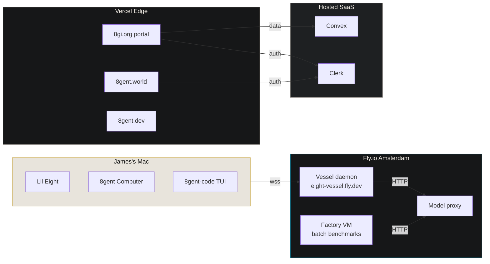
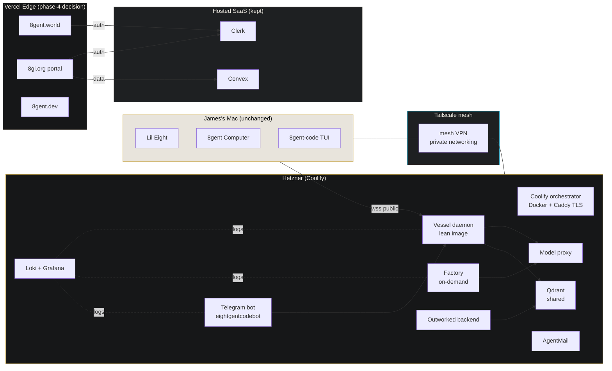
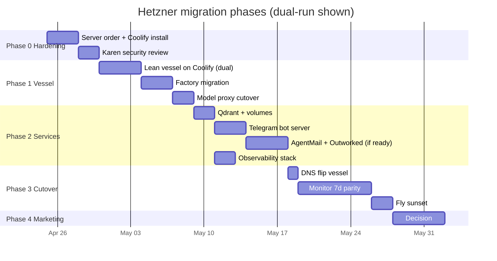
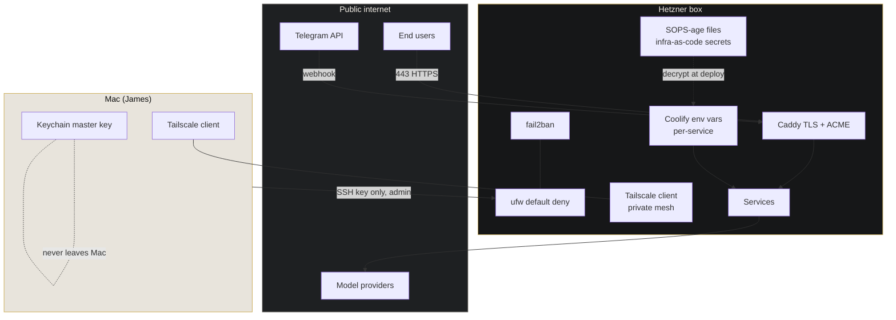

# Hetzner + Coolify Migration

Owner: Rishi (8TO). Security review: Karen (8SO).
Authored: 2026-04-24.
Branch: `docs/prd/hetzner-coolify-migration`.
Status: plan only, no live infra touched in this PR.
Parent tracking issue: (filed after PR open).
Portal mirror: `https://8gi.org/media/infra/hetzner-migration` (auth-gated, see 8gi-org PR `feat/media-infra-hetzner-migration`).

---

## 1. Executive summary

James bought a Hetzner server on 2026-04-23 so 8GI can stop renting its backend piecemeal and start owning the stack per Principle 2 ("free and local by default" read as sovereignty at the infra layer, not "one provider"). Today the backend is split across Fly.io (vessel daemon, ~$31.40/mo March, 88% factory burn), Vercel (marketing and portal sites), and hosted SaaS (Convex, Clerk). This plan moves the self-hostable workloads (vessel daemon, Qdrant, Telegram bot server, AgentMail, Outworked backend if ready) to a single Hetzner box orchestrated by Coolify, keeps Convex and Clerk hosted because rebuilding them is out of scope, and keeps Vercel on the table for marketing surfaces until a phase-4 decision. Fly.io gets sunset only after dual-run parity is proven per phase.

## 2. Context and motivation

- **Fly.io economics.** March bill $31.40; 88% was the factory machine running batch benchmarks. Lean vessels auto-stop and cost $0 when idle. Hetzner flips the cost model: pay a fixed monthly for a box that can host vessel + factory + Qdrant + bots simultaneously. Breakeven depends on James filling more than one Fly-worth of workload on the box, which is already the case.
- **Sovereignty.** 8GI publicly advocates local-first AI (Principle 2, K-shaped economy thesis, Spalding Paradox). The backend being rented from a US hyperscaler contradicts the message. EU-based dedicated hardware is on-brand.
- **Scale ceiling.** Fly 8GB uncompressed image limit forced the lean-vessel pattern. Qdrant + bundled models + factory workloads exceed that ceiling cleanly. Owning the box removes the ceiling.
- **Secrets blast radius.** Spreading workloads across three PaaS providers means three secret stores, three audit trails, three blast-radius maps. One Hetzner box plus Coolify plus Tailscale consolidates this under Karen's 8gent Computer security spec (`docs/prd/8gent-computer/security.md`) which already defines Keychain + sparse-bundle + deny-list patterns we can extend server-side.
- **Coolify is the orchestration match.** Apache-2.0, self-hosted, Docker Compose under the hood, one-click deploys from Git, built-in TLS via Caddy, works fine on a single Hetzner box. Not Kubernetes (overkill for one node). Not bare Docker Compose (no UI, no previews, no zero-downtime deploy). Not Dokku (smaller ecosystem, fewer integrations).

## 3. Scope

### 3.1 In scope (moves to Hetzner)

- Vessel daemon (currently `eight-vessel.fly.dev`), including lean vessel image and factory variant.
- Qdrant local container (server-side, separate from the per-install on-device Qdrant in Karen's spec).
- Telegram bot server for `@eightgentcodebot` (bridge to local + cloud vessels).
- AgentMail backend infrastructure (if James confirms it is ready to leave current host).
- Outworked backend, if not already dependent on Vercel-specific primitives.
- Observability: Loki + Grafana stack as a Coolify service.
- Backups: Hetzner Storage Box nightly snapshot, plus Coolify's own backup per service.

### 3.2 Hosted SaaS that stays (with justification)

- **Convex.** Rebuilding a real-time sync backend with row-level auth against Clerk is weeks of work for zero user-facing benefit. Convex charges are low at current scale and support Clerk JWTs natively. Keep.
- **Clerk.** Auth is not a place to self-host without a dedicated SRE. Magic links, OTP, org management, JWT minting, SOC 2. Clerk's free tier covers 8GI's user volume. Keep.
- **Vercel.** Phase 4 decision. Marketing sites (`8gent.dev`, `8gent.world`, `8gi.org` itself) benefit from Vercel's edge CDN and image optimisation. Moving them to Hetzner + Caddy is doable but Karen has to redo CSP/HSTS/DDoS story. Defer.
- **Domain registrar.** Stays where the domains are today.

### 3.3 Out of scope (Hetzner is explicitly NOT for this)

- **Mac-local daemons.** `8gent Computer` and `Lil Eight` run on James's Mac only. Per `project_eight_vs_lil_eight.md` these stay on-device. Hetzner is server-side only.
- **Per-install user Qdrant.** The Qdrant instance in Karen's security spec lives on the user's Mac encrypted by their Keychain master. Server-side Hetzner Qdrant is a separate workload with a separate purpose (shared knowledge indexes, not per-user memory).
- **On-device model inference.** KittenTTS, Lil Eight ML, on-device agent inference all stay on-device.
- **Private keys for remote wipe.** Per Karen's spec §7.1, the Ed25519 private key for signed remote-wipe commands stays offline with James. Hetzner never holds it.

## 4. Non-goals for the migration itself

- No DNS changes this turn.
- No Fly.io decommissioning this turn. Dual-run first, then sunset per phase gate.
- No Vercel migration in phases 0-3.
- No Kubernetes, ArgoCD, Terraform. Coolify is the orchestrator, git is the source of truth, done.
- No Vault or external secret manager in v1. Coolify env vars plus SOPS for infra-as-code secrets is enough until traffic justifies more.

## 5. Service inventory

| Service | Current host | Target host | Notes |
|---|---|---|---|
| 8gent-code vessel daemon (lean) | Fly.io (`eight-vessel.fly.dev`) | Hetzner / Coolify | Dual-run phase 1 |
| 8gent-code factory (Ollama + benchmarks) | Fly.io (4x CPU VM, batch) | Hetzner / Coolify | Primary cost saver |
| Qdrant (shared / server) | Not deployed yet | Hetzner / Coolify | New in phase 2 |
| Telegram bot server (`@eightgentcodebot`) | Not deployed yet | Hetzner / Coolify | New in phase 2, references `project_8gent_bot_handle.md` |
| AgentMail server | Placeholder - James to confirm | Hetzner / Coolify | Phase 2 |
| Outworked backend | Placeholder - James to confirm | Hetzner / Coolify (or keep, TBD) | Phase 2-3 |
| Observability (Loki + Grafana) | None | Hetzner / Coolify | Phase 2 |
| 8gi.org portal | Vercel | Vercel (phase 4 decision) | Keep for now |
| 8gent.world | Vercel | Vercel (phase 4 decision) | Keep for now |
| 8gent.dev | Vercel | Vercel (phase 4 decision) | Keep for now |
| Convex | Convex Cloud | Convex Cloud | No change |
| Clerk | Clerk Cloud | Clerk Cloud | No change |
| Mac-local 8gent Computer | Mac | Mac | No change |
| Mac-local Lil Eight | Mac | Mac | No change |
| Model proxy | Fly.io | Hetzner / Coolify (phase 1) | Routes inference to local GPU or cloud providers |

## 6. Architecture

### 6.1 Current state

### 6.2 Target state

### 6.3 Migration path (dual-run timeline)

### 6.4 Network topology (secrets + trust)

## 7. Security (inherits Karen's work)

Full security spec for the on-device 8gent Computer lives at `docs/prd/8gent-computer/security.md`. The server-side Hetzner posture inherits the same principles with different mechanisms:

### 7.1 Secrets

- **Mac admin secrets** (SSH keys, Tailscale auth key, Hetzner API token): macOS Keychain, same service-prefix convention as Karen's spec §1.1.
- **Server-side per-service secrets** (Telegram bot token, Convex deploy key, Clerk secret, provider API keys): Coolify env vars, encrypted at rest by Coolify, not in git.
- **Infra-as-code secrets** (docker-compose overrides, SOPS-encrypted): SOPS + age keys. Private age key in Mac Keychain, public in repo. Unlike the Mac master key, rotation is cheap here (re-encrypt a small set of YAML files).
- **Never in chat.** Per memory `feedback_no_secrets_in_chat`, no tokens get pasted into Claude conversations. File-based injection only.

### 7.2 Network posture

- **ufw default deny.** Only 22 (SSH, key only), 80 (Caddy ACME), 443 (Caddy TLS) open to public. Everything else blocked.
- **SSH key auth only.** `PasswordAuthentication no`, `PermitRootLogin no`. Admin user in `sudo` group.
- **fail2ban** on sshd. 3 strikes, 24h ban. Standard config.
- **Tailscale mesh** connects James's Mac to the box for private networking. Admin/debug traffic rides Tailscale, not public internet. Tailscale ACLs restrict the box's outbound to only what services need (model providers, Telegram, Convex). Mesh is opt-in per-machine, not a full VPN takeover.
- **Coolify dashboard** bound to Tailscale interface only, not public. Public access to Coolify UI is disabled.

### 7.3 TLS

- Caddy auto-provisions Let's Encrypt certs for every service at `*.8gent.app` (or chosen subdomain scheme). HSTS enabled. HTTP redirects to HTTPS. Renewals automatic.

### 7.4 Backups + snapshots

- **Hetzner auto-snapshot** weekly at the VPS level (server image).
- **Hetzner Storage Box** for Coolify's nightly backup of service volumes (Qdrant data, Postgres if added, etc).
- **Retention**: 7 daily, 4 weekly, 3 monthly.
- **Restore drill**: once per quarter, restore a snapshot to a staging box, run smoke tests.

### 7.5 Inheritance from Karen's 8gent Computer spec

Where concepts map cleanly:

| Karen spec concept | Hetzner analogue |
|---|---|
| Keychain master key (`com.8gent.computer.master-key`) | SOPS age master private key (Mac Keychain, not on box) |
| APFS encrypted sparse bundle for Qdrant | LUKS-encrypted volume mount for server Qdrant data dir |
| TCC entitlements | Linux user/group + capabilities, service isolation via Coolify containers |
| Bundle-id deny-list | not applicable server-side, but Karen may extend to "which outbound IPs this service is allowed to reach" |
| FileVault install gate | disk encryption at provision time (Hetzner supports this at install) |
| Remote wipe via signed Ed25519 | not needed server-side, admin can `hetzner rescue` and wipe |

### 7.6 Security review gate

Karen (8SO) reviews phase 0 completion before any production traffic. Karen signs off in the parent tracking issue with a checklist result. Until signed off, phase 1 does not start.

## 8. Phase plan

### Phase 0 - Server hardening + Coolify install

**Goal:** Box exists, is locked down, runs Coolify, no workloads yet.

Tasks:
1. Order Hetzner server per James's spec choice (see §12 open questions).
2. Install Ubuntu 24.04 LTS, LUKS disk encryption at provision.
3. `adduser james`, add to sudo, disable root SSH, drop password auth.
4. ufw default deny, allow 22/80/443, enable.
5. Install fail2ban with sshd jail.
6. Install Tailscale, authenticate, set up ACL restricting access to James's Mac + the box.
7. Bind Coolify dashboard to Tailscale interface only.
8. Install Coolify v4 LTS via official installer script.
9. Configure Coolify backup target = Hetzner Storage Box.
10. Hetzner auto-snapshot enabled weekly.
11. Karen security review, sign-off required.

**Acceptance criteria:**
- `nmap` from outside the Tailscale mesh shows only 22/80/443 open.
- SSH password auth rejected.
- Tailscale `tailscale ping` from James's Mac to the box succeeds.
- Coolify UI only reachable via Tailscale IP, not public.
- Backup target configured, Coolify test backup succeeds.
- Karen signs off in the parent issue.

**Rollback:** Box is empty. Destroy and reprovision if anything is wrong.

### Phase 1 - Vessel migration (dual-run)

**Goal:** Lean vessel + factory + model proxy run on Hetzner alongside Fly, same protocol, same auth tokens.

Tasks:
1. Coolify application: `8gent-vessel-lean` from `8gi-foundation/8gent-code` repo, Dockerfile `packages/board-vessel/Dockerfile`, deploy preview on push to `main`.
2. Coolify application: `8gent-factory` from same repo with Ollama image variant.
3. Coolify application: `model-proxy` from `packages/model-proxy` (if packaged) or from wherever it currently lives on Fly.
4. Copy Fly env vars to Coolify env vars per service. `VESSEL_AUTH_TOKEN` matches Fly side for dual-run.
5. Caddy config: new hostname `vessel.8gent.app` (or `vessel-hetz.8gent.app` for dual-run) pointing at vessel container.
6. Mac TUI env var `VESSEL_URL` switchable between Fly and Hetzner for A/B smoke testing.
7. Run benchmark suite against Hetzner vessel, compare with Fly baseline.

**Acceptance criteria:**
- `wss://vessel-hetz.8gent.app` responds to `type:ping` with `type:pong` and auth handshake.
- Session create/resume/destroy round-trip identical to Fly.
- Model proxy returns completions for at least one local path and one cloud path (OpenRouter `:free`).
- Benchmark parity: Hetzner vessel scores within 2% of Fly baseline on the standard suite.
- Dual-run stable for 3 days minimum before Phase 2 starts.

**Rollback:** Flip `VESSEL_URL` back to Fly. Leave Hetzner vessel running for debugging. No user impact since Fly is still live.

### Phase 2 - Qdrant, bot server, AgentMail, Outworked, observability

**Goal:** Services that do not exist on Fly today stand up on Hetzner fresh, cleanly.

Tasks:
1. Coolify application: Qdrant (bundled binary or official image), LUKS-mounted data volume, bound 127.0.0.1 only inside container network.
2. Coolify application: Telegram bot server. Webhook target = `https://bot.8gent.app/webhook/<secret>`. References `project_8gent_bot_handle.md` for canonical handle.
3. Coolify application: AgentMail server (if James confirms readiness; otherwise defer to phase 2b).
4. Coolify application: Outworked backend (if confirmed ready and no Vercel-only primitives).
5. Coolify application: Loki + Grafana + Promtail stack. Scrape logs from all Coolify containers.
6. Configure Coolify backup for each stateful service volume.

**Acceptance criteria:**
- Qdrant reachable from vessel container, rejects external connections.
- Telegram webhook delivers test message end-to-end: `@eightgentcodebot /ping` returns `pong` from vessel.
- AgentMail sends and receives one test message (if in scope).
- Outworked backend health check returns 200 (if in scope).
- Grafana shows logs from vessel, factory, bot within 60 seconds of emission.

**Rollback:** Each service independently rollback-able via Coolify "redeploy previous version". Nothing depends on these yet except the bot, which has no production traffic until phase 3.

### Phase 3 - Cutover and Fly sunset

**Goal:** Stop running anything on Fly.

Tasks:
1. DNS flip: `vessel.8gent.app` A/AAAA to Hetzner IP (drop Fly CNAME).
2. Monitor 7 days. Error rate, latency, uptime, cost.
3. Fly apps `eight-vessel`, `eight-factory`, `model-proxy-<whatever>` scale to zero machines.
4. Wait 14 days, delete Fly apps entirely.
5. Cancel Fly.io billing.

**Acceptance criteria:**
- 7-day parity: error rate within 1% of pre-cutover, latency p99 within 10% of pre-cutover.
- All Telegram webhook deliveries succeed.
- Benchmark suite continues to pass.
- Fly apps at zero machines, no traffic.

**Rollback:** DNS flip back to Fly (machines at zero, need to scale up first, ~60s). Fly apps kept for 14 days specifically to enable rollback.

### Phase 4 - Public site migration (decision only in this PRD)

**Goal:** Decide if Vercel stays or Hetzner absorbs marketing sites.

Inputs:
- Cost of Vercel for marketing traffic volume (James to fill).
- CSP/HSTS/DDoS coverage loss if leaving Vercel edge.
- Image optimisation cost of doing it ourselves vs Vercel.
- Bandwidth on Hetzner plan vs Vercel overage pattern.

Decision made at end of phase 3 based on real data from 7-14 days of Hetzner operation. No code changes in this PR.

## 9. Cost analysis

### 9.1 Current monthly spend (best known)

| Line item | Amount | Source |
|---|---|---|
| Fly.io vessel + factory + proxy | **$31.40** (March) | `project_fly_architecture.md` |
| Vercel (8gi.org, 8gent.world, 8gent.dev, etc) | placeholder - James to fill | needs billing dashboard check |
| Domain renewals (avg) | placeholder - James to fill | ~12-18 domains |
| Convex | placeholder - James to fill | free tier or paid? |
| Clerk | placeholder - James to fill | free tier or Pro? |
| OpenRouter / model provider credits | placeholder - James to fill | usage-based |
| **Subtotal known** | **$31.40** | |
| **Subtotal unknown** | **TBD** | |

Data needed from James to complete the table:
- Vercel billing screenshot or CSV export.
- Convex billing tier.
- Clerk billing tier.
- Domain registrar annual spend divided by 12.
- OpenRouter monthly average for last 3 months.

### 9.2 Projected Hetzner monthly

| Line item | Amount | Assumptions |
|---|---|---|
| Hetzner server rental | placeholder - James to fill | depends on spec chosen (see §12.1) |
| Hetzner Storage Box (1TB) | roughly €4 | backups |
| Hetzner bandwidth overage | roughly €0 at current volume | generous included allowance |
| Coolify | **$0** (Apache 2.0 self-hosted) | no Pro tier required for one-box |
| **Subtotal** | **TBD** | pending spec |

Hetzner spec scenarios (for James to choose from):
- **Light:** AX-Line or CX52 cloud (~€20-30/mo). Enough for lean vessels + Qdrant, not factory.
- **Middle:** AX41-NVMe dedicated (~€40-50/mo). Enough for everything in this PRD.
- **Heavy:** AX101 or GPU-equipped (€100+/mo). Only if we want on-box Ollama inference for factory.

### 9.3 Projected SaaS floor after migration

| Line item | Amount | Notes |
|---|---|---|
| Convex | unchanged | stays hosted |
| Clerk | unchanged | stays hosted |
| Domain renewals | unchanged | annual, averaged |
| Vercel | decided in phase 4 | keep marketing for now |

### 9.4 Delta analysis

- **Savings:** Fly.io elimination (~$31.40/mo). Factory runs at zero marginal cost on owned hardware instead of $27.64/mo burst.
- **New cost:** Hetzner rental (€20-50/mo depending on spec).
- **Net delta at Middle spec:** roughly break-even to -€10/mo savings after euro/dollar conversion.
- **Real win:** not the dollars, it is capability. Same monthly gets a box that can host factory + Qdrant + bot + AgentMail + Outworked + observability, vs Fly's per-app cost scaling.
- **Breakeven month:** month 1 if new services (Qdrant, bot, AgentMail) would otherwise have been deployed to Fly at $10-20/mo each. Month 3-4 if we are strictly comparing like-for-like vessel hosting.

### 9.5 One-time costs

| Item | Estimate |
|---|---|
| Migration labour (Rishi, Karen) | roughly 20-30 hours across 3-4 weeks |
| DNS cutover + 7-day dual-run | included in above |
| Downtime buffer (phase 3 flip) | target 0, budget 30 minutes worst case |
| Hetzner setup fee | typically €0 for cloud, €39-69 for dedicated AX-line one-time |

## 10. Risk register

| Risk | Likelihood | Impact | Mitigation |
|---|---|---|---|
| Hetzner box fails | low | high | Weekly snapshot + Storage Box backup. Dual-run during phase 1-3 means Fly is a live fallback. |
| DNS cutover breaks clients | medium | medium | Low TTL (60s) 48h before cutover. Fly kept warm for 14 days. |
| Coolify version upgrade breaks services | medium | medium | Pin Coolify version, upgrade on schedule after staging test. |
| Karen finds hardening gap in phase 0 review | medium | low | That is the purpose of the review. Fix before phase 1. No traffic on the box yet. |
| Qdrant data volume fills up | low | medium | Alerts from Grafana at 80% capacity. Box has disk headroom in Middle spec. |
| Telegram bot token leaks via Coolify env | low | high | Coolify env vars encrypted at rest. SOPS for infra-as-code. Karen sign-off on env var practices in phase 2. |
| Fly.io sunset done too early | low | high | 14-day buffer after DNS flip before app deletion. Billing continues until apps deleted. |
| James's Tailscale key rotates and locks admin out | low | medium | Hetzner Rescue System as break-glass. Documented in runbook. |
| Coolify dashboard exposed publicly by misconfig | medium | high | Bind to Tailscale IP at install, Karen audit, nmap weekly. |
| EU data residency changes requirements | low | medium | Hetzner EU datacenter choice (Falkenstein / Helsinki) locks residency. |

## 11. Open questions for James

1. **Server spec.** Light / Middle / Heavy per §9.2. Recommend Middle (AX41-NVMe).
2. **Datacenter.** Falkenstein (DE) / Helsinki (FI) / Ashburn (US). Recommend Falkenstein for EU sovereignty narrative + low latency from Dublin.
3. **AgentMail migration readiness.** Is AgentMail on Fly / Vercel / somewhere, and is James ready to move it in phase 2?
4. **Outworked backend readiness.** Same question. Where does it live today, and is it Vercel-bound?
5. **Vessel domain naming during dual-run.** `vessel-hetz.8gent.app` vs `v2.8gent.app` vs keep `vessel.8gent.app` and flip DNS hard. Recommend named hostname during dual-run.
6. **Coolify authentication.** Clerk SSO for Coolify dashboard (via OIDC) vs admin user + 2FA. Recommend admin user + 2FA in v1, Clerk OIDC later.
7. **Backup retention.** 7/4/3 (daily/weekly/monthly) vs something cheaper. Recommend 7/4/3.
8. **Fly sunset trigger.** Time-based (14 days after DNS flip) vs metric-based (error rate < threshold for N days). Recommend time-based, simpler.
9. **Phase 4 Vercel decision cadence.** Review once at end of phase 3 vs quarterly review. Recommend once at end of phase 3 then drop if staying on Vercel.

## 12. References

- `docs/prd/8gent-computer/architecture.md` - on-device app, informs package reuse patterns.
- `docs/prd/8gent-computer/security.md` - Karen's security spec, inherited principles.
- `docs/specs/DAEMON-PROTOCOL.md` - WS protocol, unchanged by this migration.
- Memory: `project_hetzner_infra.md`, `project_fly_architecture.md`, `project_8gent_architecture.md`, `project_8gi_org.md`, `project_8gent_bot_handle.md`, `project_eight_vs_lil_eight.md`.
- Portal: `https://8gi.org/media/infra/hetzner-migration` (auth-gated).
- Parent tracking issue: filed against `8gi-foundation/8gent-code`.
