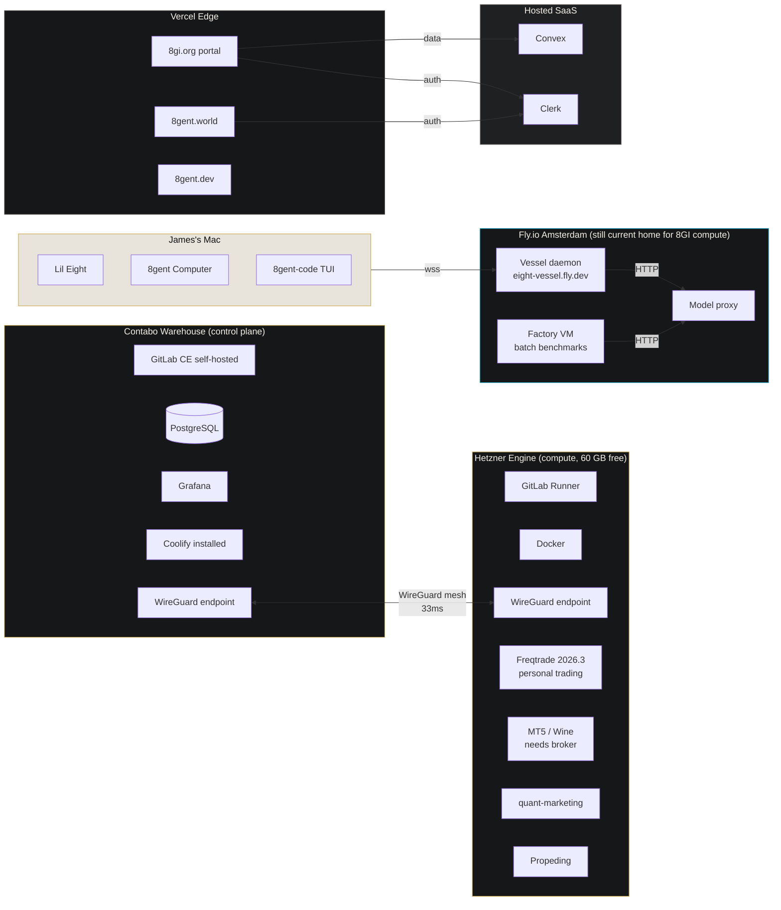
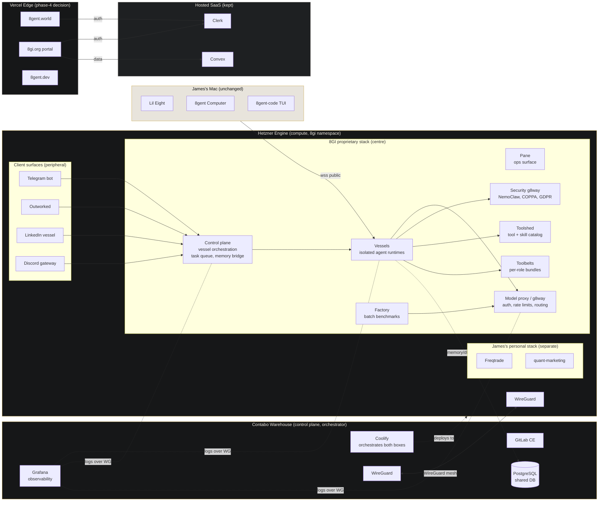
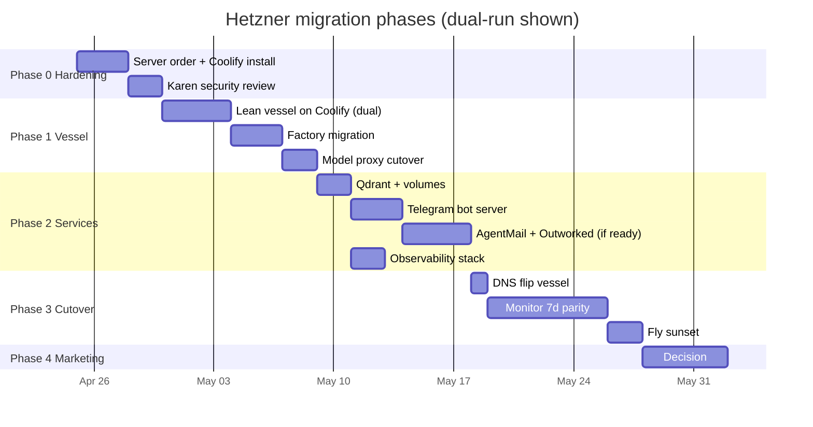
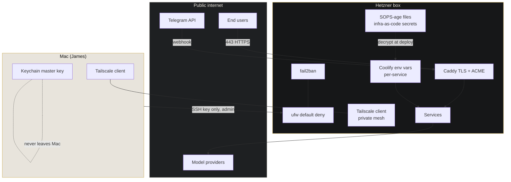
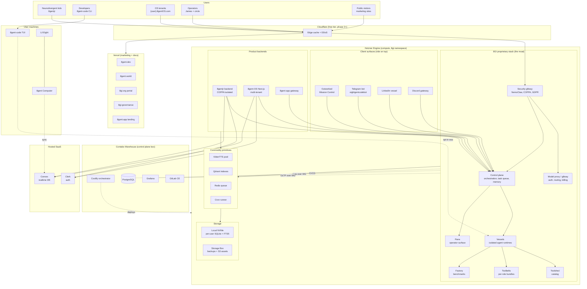

# Hetzner + Coolify Migration

Owner: Rishi (8TO). Security review: Karen (8SO).
Authored: 2026-04-24. Revised: 2026-04-24 (v3).
Branch: `docs/prd/hetzner-coolify-migration`.
Status: plan only, no live infra touched in this PR.
Parent tracking issue: (filed after PR open).
Portal mirror: `https://8gi.org/media/infra/hetzner-migration` (auth-gated, see 8gi-org PR `feat/media-infra-hetzner-migration`).

---

## v3 changelog (2026-04-24)

James provided three non-negotiable corrections that invalidate parts of v2. v3 amends rather than replaces.

1. **Current-state correction.** v2 treated Hetzner as greenfield. Reality: two boxes already linked by WireGuard mesh (33ms). Contabo "Warehouse" (24 GB, 8 used) runs GitLab CE, PostgreSQL, Grafana, Coolify, WireGuard. This is the control plane. Hetzner "Engine" (62 GB, 1.6 used, SSH 2222) runs GitLab Runner, Docker, WireGuard, plus James's personal trading stack (Freqtrade 2026.3, MT5/Wine flagged "needs broker", quant-marketing, Propeding). 60 GB free RAM on Engine is where 8GI compute workloads land. SSH pubkey + Hetzner API key live in `.env` at root of `8gi-governance` repo (lines 62-64 under `# HETZNER CLOUD`, never displayed, file-based injection only per `feedback_no_secrets_in_chat`). Phase 0 no longer installs Coolify, GitLab, or Postgres: it adopts what's already there by creating an `8gi` namespace in existing Coolify, registering Engine as a deployment target, provisioning the first vessel container, and wiring its DB to existing Warehouse Postgres via WireGuard private IPs. Diagrams in §6.1 and §6.2 now show the WireGuard mesh, not Tailscale-as-the-only-option.

2. **Proprietary stack over Outworked.** James's words: "stop mentioning Outworked, its more important to have our proprietary repositories and architecture, the control plane, pane, model proxy, vessels, security g8way, toolshed, toolbelts the whole dream." §16 (ecosystem diagram) and §17 (shared primitives, formerly §15) are rewritten so the proprietary layer (control plane, pane, model proxy / g8way, vessels, security g8way, toolshed, toolbelts) is centred. Outworked is demoted to a sibling client surface alongside Telegram bot and LinkedIn vessel, not a first-class target. Per `feedback_proprietary_over_outworked`: proprietary is the moat; Outworked is a consumer.

3. **Business model.** New §19 "Business model and revenue path." Seven revenue concepts: licensed g8way deployments, managed vessel hosting, model proxy usage tiers, 8gentjr (stays free forever per constitution, no monetisation proposed), consulting / bespoke deployments, open-core (8gent-code MIT free forever, commercial features paid), data sovereignty proposition for EU. Each tagged short-term (0-6mo) / medium (6-18mo) / long-term (18mo+). Breakeven projection placeholder labelled as such.

v2 content retained; v3 deltas are additive or in-place amendments. No section was deleted.

---

## 1. Executive summary

**v3 correction.** James already owns the infra. Two boxes linked by WireGuard mesh (33ms), live well before this PRD was drafted:

- **Contabo "Warehouse"** (24 GB RAM, 8 used): the control plane. GitLab CE self-hosted, PostgreSQL, Grafana, Coolify, WireGuard endpoint.
- **Hetzner "Engine"** (62 GB RAM, 1.6 used, SSH on 2222): the compute target. GitLab Runner, Docker, WireGuard, plus James's personal trading stack (Freqtrade 2026.3, MT5/Wine flagged "needs broker connection", quant-marketing, Propeding) occupying the 1.6 GB. 60 GB free RAM on Engine is where 8GI compute workloads land.

The migration is therefore not "stand up a fresh box"; it is "move Fly workloads into the existing mesh under the existing Coolify." Phase 0 adopts what is running: create an `8gi` namespace in the existing Coolify, register Engine as a deployment target, provision the first vessel container, point its DB to Warehouse Postgres over WireGuard private IPs, confirm logs flow to existing Grafana. Nothing new is installed at the platform layer.

The proprietary stack is the product. Control plane, pane, model proxy / g8way, vessels, security g8way, toolshed, toolbelts. These are what 8GI licenses, hosts, and sells. Outworked, Telegram bot, LinkedIn vessel, Discord gateway are sibling client surfaces that ride on top; they do not replace the proprietary layer in the diagram.

Convex and Clerk stay hosted because rebuilding them offers zero user-facing benefit. Vercel stays for marketing until a phase-4 decision. Fly.io sunsets only after dual-run parity is proven. §19 turns self-hosted sovereignty into revenue: licensed g8way, managed vessel hosting, model proxy tiers, open-core commercial features, EU data-sovereignty positioning. 8gentjr stays free forever per constitution.

**Secrets note.** SSH public key and Hetzner API token live in `.env` at root of `8gi-governance` repo, lines 62-64 under `# HETZNER CLOUD`. Never displayed in chat. File-based injection only, per `feedback_no_secrets_in_chat`.

## 2. Context and motivation

- **Fly.io economics.** March bill $31.40; 88% was the factory machine running batch benchmarks. Lean vessels auto-stop and cost $0 when idle. Hetzner flips the cost model: pay a fixed monthly for a box that can host vessel + factory + Qdrant + bots simultaneously. Breakeven depends on James filling more than one Fly-worth of workload on the box, which is already the case.
- **Sovereignty.** 8GI publicly advocates local-first AI (Principle 2, K-shaped economy thesis, Spalding Paradox). The backend being rented from a US hyperscaler contradicts the message. EU-based dedicated hardware is on-brand.
- **Scale ceiling.** Fly 8GB uncompressed image limit forced the lean-vessel pattern. Qdrant + bundled models + factory workloads exceed that ceiling cleanly. Owning the box removes the ceiling.
- **Secrets blast radius.** Spreading workloads across three PaaS providers means three secret stores, three audit trails, three blast-radius maps. One Hetzner box plus Coolify plus Tailscale consolidates this under Karen's 8gent Computer security spec (`docs/prd/8gent-computer/security.md`) which already defines Keychain + sparse-bundle + deny-list patterns we can extend server-side.
- **Coolify is the orchestration match.** Apache-2.0, self-hosted, Docker Compose under the hood, one-click deploys from Git, built-in TLS via Caddy, works fine on a single Hetzner box. Not Kubernetes (overkill for one node). Not bare Docker Compose (no UI, no previews, no zero-downtime deploy). Not Dokku (smaller ecosystem, fewer integrations).

## 3. Scope

### 3.1 In scope (moves to Hetzner)

- Vessel daemon (currently `eight-vessel.fly.dev`), including lean vessel image and factory variant.
- Qdrant local container (server-side, separate from the per-install on-device Qdrant in Karen's spec).
- Telegram bot server for `@eightgentcodebot` (bridge to local + cloud vessels).
- AgentMail backend infrastructure (if James confirms it is ready to leave current host).
- Outworked backend, if not already dependent on Vercel-specific primitives.
- Observability: Loki + Grafana stack as a Coolify service.
- Backups: Hetzner Storage Box nightly snapshot, plus Coolify's own backup per service.

### 3.2 Hosted SaaS that stays (with justification)

- **Convex.** Rebuilding a real-time sync backend with row-level auth against Clerk is weeks of work for zero user-facing benefit. Convex charges are low at current scale and support Clerk JWTs natively. Keep.
- **Clerk.** Auth is not a place to self-host without a dedicated SRE. Magic links, OTP, org management, JWT minting, SOC 2. Clerk's free tier covers 8GI's user volume. Keep.
- **Vercel.** Phase 4 decision. Marketing sites (`8gent.dev`, `8gent.world`, `8gi.org` itself) benefit from Vercel's edge CDN and image optimisation. Moving them to Hetzner + Caddy is doable but Karen has to redo CSP/HSTS/DDoS story. Defer.
- **Domain registrar.** Stays where the domains are today.

### 3.3 Out of scope (Hetzner is explicitly NOT for this)

- **Mac-local daemons.** `8gent Computer` and `Lil Eight` run on James's Mac only. Per `project_eight_vs_lil_eight.md` these stay on-device. Hetzner is server-side only.
- **Per-install user Qdrant.** The Qdrant instance in Karen's security spec lives on the user's Mac encrypted by their Keychain master. Server-side Hetzner Qdrant is a separate workload with a separate purpose (shared knowledge indexes, not per-user memory).
- **On-device model inference.** KittenTTS, Lil Eight ML, on-device agent inference all stay on-device.
- **Private keys for remote wipe.** Per Karen's spec §7.1, the Ed25519 private key for signed remote-wipe commands stays offline with James. Hetzner never holds it.

## 4. Non-goals for the migration itself

- No DNS changes this turn.
- No Fly.io decommissioning this turn. Dual-run first, then sunset per phase gate.
- No Vercel migration in phases 0-3.
- No Kubernetes, ArgoCD, Terraform. Coolify is the orchestrator, git is the source of truth, done.
- No Vault or external secret manager in v1. Coolify env vars plus SOPS for infra-as-code secrets is enough until traffic justifies more.

## 5. Service inventory

| Service | Current host | Target host | Notes |
|---|---|---|---|
| 8gent-code vessel daemon (lean) | Fly.io (`eight-vessel.fly.dev`) | Hetzner / Coolify | Dual-run phase 1 |
| 8gent-code factory (Ollama + benchmarks) | Fly.io (4x CPU VM, batch) | Hetzner / Coolify | Primary cost saver |
| Qdrant (shared / server) | Not deployed yet | Hetzner / Coolify | New in phase 2 |
| Telegram bot server (`@eightgentcodebot`) | Not deployed yet | Hetzner / Coolify | New in phase 2, references `project_8gent_bot_handle.md` |
| AgentMail server | Placeholder - James to confirm | Hetzner / Coolify | Phase 2 |
| Outworked backend | Placeholder - James to confirm | Hetzner / Coolify (or keep, TBD) | Phase 2-3 |
| Observability (Loki + Grafana) | None | Hetzner / Coolify | Phase 2 |
| 8gi.org portal | Vercel | Vercel (phase 4 decision) | Keep for now |
| 8gent.world | Vercel | Vercel (phase 4 decision) | Keep for now |
| 8gent.dev | Vercel | Vercel (phase 4 decision) | Keep for now |
| Convex | Convex Cloud | Convex Cloud | No change |
| Clerk | Clerk Cloud | Clerk Cloud | No change |
| Mac-local 8gent Computer | Mac | Mac | No change |
| Mac-local Lil Eight | Mac | Mac | No change |
| Model proxy | Fly.io | Hetzner / Coolify (phase 1) | Routes inference to local GPU or cloud providers |

## 6. Architecture

### 6.1 Current state (v3 corrected)

Two existing boxes in a WireGuard mesh run the platform layer today. Fly is separately hosting 8GI's vessel daemon. 8GI compute work has not yet moved onto the mesh.

### 6.2 Target state (v3 corrected)

Warehouse Coolify orchestrates. 8GI compute workloads land primarily on Hetzner Engine. The proprietary layer (control plane, pane, model proxy / g8way, vessels, security g8way, toolshed, toolbelts) is centred in the diagram. Outworked, Telegram bot, LinkedIn vessel are peripheral client surfaces.

### 6.3 Migration path (dual-run timeline)

### 6.4 Network topology (secrets + trust)

## 7. Security (inherits Karen's work)

Full security spec for the on-device 8gent Computer lives at `docs/prd/8gent-computer/security.md`. The server-side Hetzner posture inherits the same principles with different mechanisms:

### 7.1 Secrets

- **Mac admin secrets** (SSH keys, Tailscale auth key, Hetzner API token): macOS Keychain, same service-prefix convention as Karen's spec §1.1.
- **Server-side per-service secrets** (Telegram bot token, Convex deploy key, Clerk secret, provider API keys): Coolify env vars, encrypted at rest by Coolify, not in git.
- **Infra-as-code secrets** (docker-compose overrides, SOPS-encrypted): SOPS + age keys. Private age key in Mac Keychain, public in repo. Unlike the Mac master key, rotation is cheap here (re-encrypt a small set of YAML files).
- **Never in chat.** Per memory `feedback_no_secrets_in_chat`, no tokens get pasted into Claude conversations. File-based injection only.

### 7.2 Network posture

- **ufw default deny.** Only 22 (SSH, key only), 80 (Caddy ACME), 443 (Caddy TLS) open to public. Everything else blocked.
- **SSH key auth only.** `PasswordAuthentication no`, `PermitRootLogin no`. Admin user in `sudo` group.
- **fail2ban** on sshd. 3 strikes, 24h ban. Standard config.
- **Tailscale mesh** connects James's Mac to the box for private networking. Admin/debug traffic rides Tailscale, not public internet. Tailscale ACLs restrict the box's outbound to only what services need (model providers, Telegram, Convex). Mesh is opt-in per-machine, not a full VPN takeover.
- **Coolify dashboard** bound to Tailscale interface only, not public. Public access to Coolify UI is disabled.

### 7.3 TLS

- Caddy auto-provisions Let's Encrypt certs for every service at `*.8gent.app` (or chosen subdomain scheme). HSTS enabled. HTTP redirects to HTTPS. Renewals automatic.

### 7.4 Backups + snapshots

- **Hetzner auto-snapshot** weekly at the VPS level (server image).
- **Hetzner Storage Box** for Coolify's nightly backup of service volumes (Qdrant data, Postgres if added, etc).
- **Retention**: 7 daily, 4 weekly, 3 monthly.
- **Restore drill**: once per quarter, restore a snapshot to a staging box, run smoke tests.

### 7.5 Inheritance from Karen's 8gent Computer spec

Where concepts map cleanly:

| Karen spec concept | Hetzner analogue |
|---|---|
| Keychain master key (`com.8gent.computer.master-key`) | SOPS age master private key (Mac Keychain, not on box) |
| APFS encrypted sparse bundle for Qdrant | LUKS-encrypted volume mount for server Qdrant data dir |
| TCC entitlements | Linux user/group + capabilities, service isolation via Coolify containers |
| Bundle-id deny-list | not applicable server-side, but Karen may extend to "which outbound IPs this service is allowed to reach" |
| FileVault install gate | disk encryption at provision time (Hetzner supports this at install) |
| Remote wipe via signed Ed25519 | not needed server-side, admin can `hetzner rescue` and wipe |

### 7.6 Security review gate

Karen (8SO) reviews phase 0 completion before any production traffic. Karen signs off in the parent tracking issue with a checklist result. Until signed off, phase 1 does not start.

## 8. Phase plan

### Phase 0 - Adopt existing mesh, create 8gi namespace (v3 corrected)

**Goal:** Use the existing Warehouse Coolify to run the first 8GI workload on Hetzner Engine. No new platform installs.

v2 assumed this phase included installing Coolify, provisioning Postgres, and standing up a fresh box. All three are already done. Phase 0 is now an adoption phase.

Tasks:
1. Confirm WireGuard mesh health: `wg show` on both Warehouse and Engine, verify 33ms ping, confirm private IPs resolve.
2. In existing Warehouse Coolify, create a new **project / namespace: `8gi`** (separate from personal projects to keep blast radii distinct).
3. Register Hetzner Engine as a **deployment target / server** in Coolify (if not already). Verify Coolify can push Docker images to Engine over WireGuard.
4. Audit the existing Warehouse security surface rather than re-hardening from scratch: confirm `ufw` on both boxes matches documented policy (22/2222 SSH by IP allowlist, 80, 443, WireGuard 51820, Coolify UI bound private-only), confirm SSH key-only auth, confirm `fail2ban` running on Warehouse sshd and Engine sshd:2222.
5. Review `.env` at root of `8gi-governance` repo (lines 62-64 under `# HETZNER CLOUD`) for SSH pubkey + Hetzner API key presence. Do not read or display values. Karen confirms the keys exist and are not committed anywhere public.
6. Provision the first vessel container under the `8gi` namespace on Engine (lean image, empty config, not taking traffic yet). This is the pathfinder; it validates that Coolify → WireGuard → Engine deployment works end to end.
7. Wire the pathfinder vessel's DB config to existing **Warehouse PostgreSQL** over WireGuard private IP. Create a dedicated `8gi_vessel` role with its own schema, not a superuser.
8. Confirm the pathfinder vessel's stdout/stderr reach existing **Warehouse Grafana** via whatever log shipper is already configured (promtail / vector / journald-forward): verify what is running, do not install a second stack.
9. Confirm Hetzner auto-snapshot is enabled on Engine and that Warehouse has its own backup cadence (Storage Box or otherwise). Document the existing retention, do not redesign.
10. Confirm Engine's personal workloads (Freqtrade, MT5/Wine, quant-marketing, Propeding) are in a different Docker network / Coolify project and cannot reach the `8gi` namespace. Flag MT5/Wine "needs broker" status but treat as unrelated to 8GI migration.
11. Karen security review of adopted posture. Sign-off required before Phase 1 traffic.

**Acceptance criteria:**
- `wg show` healthy on both boxes, private IPs pingable.
- Coolify UI (on Warehouse) has an `8gi` project with Engine registered as target.
- Pathfinder vessel deploys successfully, logs reach Grafana, DB reachable from within container to Warehouse Postgres over WireGuard.
- `nmap` from public internet shows only 22 (Warehouse), 2222 (Engine), 80, 443 open per box. Coolify UI not reachable publicly.
- Personal trading stack unchanged on Engine; 8gi namespace cannot read its volumes or hit its Docker network.
- Karen signs off in the parent issue.

**Rollback:** Delete the `8gi` Coolify project. Pathfinder container stops. Warehouse + Engine return to pre-migration state with no change to personal workloads.

### Phase 1 - Vessel migration (dual-run)

**Goal:** Lean vessel + factory + model proxy run on Hetzner alongside Fly, same protocol, same auth tokens.

Tasks:
1. Coolify application: `8gent-vessel-lean` from `8gi-foundation/8gent-code` repo, Dockerfile `packages/board-vessel/Dockerfile`, deploy preview on push to `main`.
2. Coolify application: `8gent-factory` from same repo with Ollama image variant.
3. Coolify application: `model-proxy` from `packages/model-proxy` (if packaged) or from wherever it currently lives on Fly.
4. Copy Fly env vars to Coolify env vars per service. `VESSEL_AUTH_TOKEN` matches Fly side for dual-run.
5. Caddy config: new hostname `vessel.8gent.app` (or `vessel-hetz.8gent.app` for dual-run) pointing at vessel container.
6. Mac TUI env var `VESSEL_URL` switchable between Fly and Hetzner for A/B smoke testing.
7. Run benchmark suite against Hetzner vessel, compare with Fly baseline.

**Acceptance criteria:**
- `wss://vessel-hetz.8gent.app` responds to `type:ping` with `type:pong` and auth handshake.
- Session create/resume/destroy round-trip identical to Fly.
- Model proxy returns completions for at least one local path and one cloud path (OpenRouter `:free`).
- Benchmark parity: Hetzner vessel scores within 2% of Fly baseline on the standard suite.
- Dual-run stable for 3 days minimum before Phase 2 starts.

**Rollback:** Flip `VESSEL_URL` back to Fly. Leave Hetzner vessel running for debugging. No user impact since Fly is still live.

### Phase 2 - Qdrant, bot server, AgentMail, Outworked, observability

**Goal:** Services that do not exist on Fly today stand up on Hetzner fresh, cleanly.

Tasks:
1. Coolify application: Qdrant (bundled binary or official image), LUKS-mounted data volume, bound 127.0.0.1 only inside container network.
2. Coolify application: Telegram bot server. Webhook target = `https://bot.8gent.app/webhook/<secret>`. References `project_8gent_bot_handle.md` for canonical handle.
3. Coolify application: AgentMail server (if James confirms readiness; otherwise defer to phase 2b).
4. Coolify application: Outworked backend (if confirmed ready and no Vercel-only primitives).
5. Coolify application: Loki + Grafana + Promtail stack. Scrape logs from all Coolify containers.
6. Configure Coolify backup for each stateful service volume.

**Acceptance criteria:**
- Qdrant reachable from vessel container, rejects external connections.
- Telegram webhook delivers test message end-to-end: `@eightgentcodebot /ping` returns `pong` from vessel.
- AgentMail sends and receives one test message (if in scope).
- Outworked backend health check returns 200 (if in scope).
- Grafana shows logs from vessel, factory, bot within 60 seconds of emission.

**Rollback:** Each service independently rollback-able via Coolify "redeploy previous version". Nothing depends on these yet except the bot, which has no production traffic until phase 3.

### Phase 3 - Cutover and Fly sunset

**Goal:** Stop running anything on Fly.

Tasks:
1. DNS flip: `vessel.8gent.app` A/AAAA to Hetzner IP (drop Fly CNAME).
2. Monitor 7 days. Error rate, latency, uptime, cost.
3. Fly apps `eight-vessel`, `eight-factory`, `model-proxy-<whatever>` scale to zero machines.
4. Wait 14 days, delete Fly apps entirely.
5. Cancel Fly.io billing.

**Acceptance criteria:**
- 7-day parity: error rate within 1% of pre-cutover, latency p99 within 10% of pre-cutover.
- All Telegram webhook deliveries succeed.
- Benchmark suite continues to pass.
- Fly apps at zero machines, no traffic.

**Rollback:** DNS flip back to Fly (machines at zero, need to scale up first, ~60s). Fly apps kept for 14 days specifically to enable rollback.

### Phase 4 - Public site migration (decision only in this PRD)

**Goal:** Decide if Vercel stays or Hetzner absorbs marketing sites.

Inputs:
- Cost of Vercel for marketing traffic volume (James to fill).
- CSP/HSTS/DDoS coverage loss if leaving Vercel edge.
- Image optimisation cost of doing it ourselves vs Vercel.
- Bandwidth on Hetzner plan vs Vercel overage pattern.

Decision made at end of phase 3 based on real data from 7-14 days of Hetzner operation. No code changes in this PR.

## 9. Cost analysis

### 9.1 Current monthly spend (best known)

| Line item | Amount | Source |
|---|---|---|
| Fly.io vessel + factory + proxy | **$31.40** (March) | `project_fly_architecture.md` |
| Vercel (8gi.org, 8gent.world, 8gent.dev, etc) | placeholder - James to fill | needs billing dashboard check |
| Domain renewals (avg) | placeholder - James to fill | ~12-18 domains |
| Convex | placeholder - James to fill | free tier or paid? |
| Clerk | placeholder - James to fill | free tier or Pro? |
| OpenRouter / model provider credits | placeholder - James to fill | usage-based |
| **Subtotal known** | **$31.40** | |
| **Subtotal unknown** | **TBD** | |

Data needed from James to complete the table:
- Vercel billing screenshot or CSV export.
- Convex billing tier.
- Clerk billing tier.
- Domain registrar annual spend divided by 12.
- OpenRouter monthly average for last 3 months.

### 9.2 Projected Hetzner monthly

| Line item | Amount | Assumptions |
|---|---|---|
| Hetzner server rental | placeholder - James to fill | depends on spec chosen (see §12.1) |
| Hetzner Storage Box (1TB) | roughly €4 | backups |
| Hetzner bandwidth overage | roughly €0 at current volume | generous included allowance |
| Coolify | **$0** (Apache 2.0 self-hosted) | no Pro tier required for one-box |
| **Subtotal** | **TBD** | pending spec |

Hetzner spec scenarios (for James to choose from):
- **Light:** AX-Line or CX52 cloud (~€20-30/mo). Enough for lean vessels + Qdrant, not factory.
- **Middle:** AX41-NVMe dedicated (~€40-50/mo). Enough for everything in this PRD.
- **Heavy:** AX101 or GPU-equipped (€100+/mo). Only if we want on-box Ollama inference for factory.

### 9.3 Projected SaaS floor after migration

| Line item | Amount | Notes |
|---|---|---|
| Convex | unchanged | stays hosted |
| Clerk | unchanged | stays hosted |
| Domain renewals | unchanged | annual, averaged |
| Vercel | decided in phase 4 | keep marketing for now |

### 9.4 Delta analysis

- **Savings:** Fly.io elimination (~$31.40/mo). Factory runs at zero marginal cost on owned hardware instead of $27.64/mo burst.
- **New cost:** Hetzner rental (€20-50/mo depending on spec).
- **Net delta at Middle spec:** roughly break-even to -€10/mo savings after euro/dollar conversion.
- **Real win:** not the dollars, it is capability. Same monthly gets a box that can host factory + Qdrant + bot + AgentMail + Outworked + observability, vs Fly's per-app cost scaling.
- **Breakeven month:** month 1 if new services (Qdrant, bot, AgentMail) would otherwise have been deployed to Fly at $10-20/mo each. Month 3-4 if we are strictly comparing like-for-like vessel hosting.

### 9.5 One-time costs

| Item | Estimate |
|---|---|
| Migration labour (Rishi, Karen) | roughly 20-30 hours across 3-4 weeks |
| DNS cutover + 7-day dual-run | included in above |
| Downtime buffer (phase 3 flip) | target 0, budget 30 minutes worst case |
| Hetzner setup fee | typically €0 for cloud, €39-69 for dedicated AX-line one-time |

## 10. Risk register

| Risk | Likelihood | Impact | Mitigation |
|---|---|---|---|
| Hetzner box fails | low | high | Weekly snapshot + Storage Box backup. Dual-run during phase 1-3 means Fly is a live fallback. |
| DNS cutover breaks clients | medium | medium | Low TTL (60s) 48h before cutover. Fly kept warm for 14 days. |
| Coolify version upgrade breaks services | medium | medium | Pin Coolify version, upgrade on schedule after staging test. |
| Karen finds hardening gap in phase 0 review | medium | low | That is the purpose of the review. Fix before phase 1. No traffic on the box yet. |
| Qdrant data volume fills up | low | medium | Alerts from Grafana at 80% capacity. Box has disk headroom in Middle spec. |
| Telegram bot token leaks via Coolify env | low | high | Coolify env vars encrypted at rest. SOPS for infra-as-code. Karen sign-off on env var practices in phase 2. |
| Fly.io sunset done too early | low | high | 14-day buffer after DNS flip before app deletion. Billing continues until apps deleted. |
| James's Tailscale key rotates and locks admin out | low | medium | Hetzner Rescue System as break-glass. Documented in runbook. |
| Coolify dashboard exposed publicly by misconfig | medium | high | Bind to Tailscale IP at install, Karen audit, nmap weekly. |
| EU data residency changes requirements | low | medium | Hetzner EU datacenter choice (Falkenstein / Helsinki) locks residency. |

## 11. Open questions for James

1. **Server spec.** Light / Middle / Heavy per §9.2. Recommend Middle (AX41-NVMe).
2. **Datacenter.** Falkenstein (DE) / Helsinki (FI) / Ashburn (US). Recommend Falkenstein for EU sovereignty narrative + low latency from Dublin.
3. **AgentMail migration readiness.** Is AgentMail on Fly / Vercel / somewhere, and is James ready to move it in phase 2?
4. **Outworked backend readiness.** Same question. Where does it live today, and is it Vercel-bound?
5. **Vessel domain naming during dual-run.** `vessel-hetz.8gent.app` vs `v2.8gent.app` vs keep `vessel.8gent.app` and flip DNS hard. Recommend named hostname during dual-run.
6. **Coolify authentication.** Clerk SSO for Coolify dashboard (via OIDC) vs admin user + 2FA. Recommend admin user + 2FA in v1, Clerk OIDC later.
7. **Backup retention.** 7/4/3 (daily/weekly/monthly) vs something cheaper. Recommend 7/4/3.
8. **Fly sunset trigger.** Time-based (14 days after DNS flip) vs metric-based (error rate < threshold for N days). Recommend time-based, simpler.
9. **Phase 4 Vercel decision cadence.** Review once at end of phase 3 vs quarterly review. Recommend once at end of phase 3 then drop if staying on Vercel.

## 12. Full ecosystem scope

v1 of this PRD planned around the self-hostable backend. v2 expands scope to the entire 8GI repo fleet so James has one picture of what runs where, and one plan for growth. Classification uses four buckets:

- **HETZNER** - backend workload moves to the owned box under Coolify.
- **VERCEL** - marketing or docs site, low traffic, image-heavy, stays on Vercel until phase 4 review.
- **HOSTED SAAS** - app code in the repo, data/auth stays on the provider (Convex, Clerk).
- **CLIENT** - library, skill, CLI, SDK. No hosting concern. Lives on the user's machine or npm.

Source: `gh repo list 8gi-foundation --limit 100 --json name,description,pushedAt` on 2026-04-24. 15 repos enumerated.

| Repo | Public | Bucket | Target | Notes |
|---|---|---|---|---|
| `8gent-code` | yes | CLIENT + HETZNER | user machine + Hetzner vessel | CLI is client; shared vessel daemon migrates per §5 |
| `8gentjr` | yes | HETZNER | Hetzner (EU, COPPA-isolated) | See §13.1 |
| `8gent-OS` | no | HETZNER | Hetzner Next.js tenants behind Caddy | See §13.3. Convex + Clerk stay hosted |
| `8gent-app` | no | HETZNER | Hetzner (app gateway for Jr + OS) | Becomes shared auth/session entry to Hetzner services |
| `8gent-vessel` | no | HETZNER | Hetzner / Coolify | Daemon image source; already in phase 1 |
| `8gi-control-plane` | no | HETZNER | Hetzner | Board vessel orchestration, Discord gateway, task queue, memory bridge |
| `8gent-telegram-app` | no | HETZNER | Hetzner | Webhook endpoint behind Caddy, shares bot server from §5 |
| `8gent-games` | no | HETZNER | Hetzner (phase 2+) | Sim world backend, not shipped yet, deferred |
| `8gent-dev` | yes | VERCEL | Vercel | Marketing / docs for 8gent.dev, low traffic, edge CDN wins |
| `8gent-world` | no | VERCEL | Vercel | Same as above for 8gent.world |
| `8gi-org` | no | VERCEL | Vercel | Inner-circle portal, Clerk-gated; Vercel phase 4 review |
| `8gi-governance` | no | VERCEL | Vercel | Governance site, same posture as 8gi-org |
| `8gent` (gateway) | yes | VERCEL | Vercel | Marketing-class landing for 8gent.app gateway; backend logic lives in `8gent-app` |
| `Skills` | yes | CLIENT | npm / git | Claude Code skills, no hosting |
| `8gi-setup` | no | CLIENT | git | Circle member setup script, ships on-device |

Totals: 8 HETZNER, 5 VERCEL, 2 CLIENT, 0 HOSTED-SAAS-only (Convex and Clerk are consumed by the HETZNER apps above, not standalone repos).

## 13. Per-product scaling

No fabricated usage numbers in this section. Every throughput or storage figure is flagged as a projection with its assumption.

### 13.1 8gentjr (shipped, free for neurodivergent kids)

Backend surface area per active child: conversation session (Convex), AAC board state (Convex), food + symptom journal (Convex), KittenTTS voice out (Hetzner compute), optional video / AAC asset fetch (object storage).

**Compute envelope (projection: KittenTTS on CPU, no GPU).** KittenTTS runs on CPU, ~250ms first-token latency on a modern x86 core for a ~20-word utterance. One AX41-NVMe core can serve roughly 4 concurrent synthesis jobs before queueing shows in user-perceived latency. Projection: AX41-NVMe (6 cores usable after headroom for vessel + bot + Coolify) serves ~24 concurrent TTS jobs. Assuming a child triggers voice ~1x per 15s during active use, that is ~360 active children at once on a single box before TTS becomes the bottleneck. At 10k registered kids with 2.5% concurrency (projection: consumer SaaS benchmark, assumes off-peak batching), peak concurrency ~250, fits.

**Storage envelope (projection: text logs + small AAC state).** Per-child per-month: conversation tokens + journal entries + AAC state. Rough order of magnitude: 5-20MB/mo in Convex (text, structured). Video/AAC assets are shared, not per-child, so they sit in object storage once (S3-compatible on Hetzner Storage Box or Cloudflare R2), ~1-5GB total catalog. 10k kids × 12MB × 12 months = 1.44TB/yr. Convex stays hosted per locked decision; the 1.44TB/yr projection is the Convex line item scaling curve, not a Hetzner disk line.

**COPPA posture.** Kids' data sits in isolated containers behind a distinct Caddy virtual host (`jr.hetzner.internal`) with a separate Coolify project, separate env bundle, separate volume mount, separate backup namespace. Falkenstein DE region (see open question #2) satisfies EU data residency for the Irish founder's default posture and covers COPPA via stricter GDPR child-data rules. Right-to-forget: scripted Convex record delete + S3 asset purge, documented in runbook (Phase 2 deliverable).

**Zero-monetisation funding.** Infra cost must stay flat or sub-linear with users. KittenTTS has zero marginal cost. Convex scales linearly but slowly at current rates. Object storage is effectively flat after initial catalog upload. Bandwidth is the risk: if video asset fetches spike, Cloudflare fronting (free tier) caches at the edge. Projection: at 10k kids, Jr adds roughly +€0 Hetzner fixed and +$20-50/mo Convex delta (assumes existing Convex plan has headroom; if not, bump one tier).

**Blast radius.** Isolation from adult data is enforced at three layers: separate Coolify project, separate Convex deployment if James agrees (new open question below), separate Clerk application. A compromise of one adult service cannot reach Jr data.

### 13.2 8gent-code (open source agent, shared vessel is opt-in)

Two deployment modes per user:
- **Local-only** (default, Principle 2). User's Mac runs 8gent, Lil Eight, 8gent Computer. Zero Hetzner load.
- **Shared vessel** (opt-in). User connects their CLI to `vessel.8gent.app` (Hetzner) for cloud compute, longer context, cross-device sessions.

**Vessel capacity (projection: lean image, 4GB RAM per concurrent session upper bound).** AX41-NVMe has 64GB RAM. Reserving 16GB for Coolify + Qdrant + observability + factory headroom leaves 48GB for vessel sessions. At 4GB per active session (projection: lean vessel image, local model off-box via proxy), that is ~12 concurrent heavy sessions. Most sessions are bursty, not continuous: if average duty cycle is 10% (projection: CLI use pattern, 90% thinking), 120 connected users share 12 active slots. Projection: single box holds ~500 connected users at 10% duty, ~120 at heavy continuous use.

**Daemon fleet model.** v1: one daemon, multi-session via `packages/daemon/agent-pool.ts` (already holds up to 10 concurrent). At growth: horizontal scale by running N daemon containers behind Caddy with session affinity on the `channel` field (protocol already supports it per `docs/specs/DAEMON-PROTOCOL.md`). Per-user daemon isolation is possible later (one container per paid tier user) but not in v1 scope.

**Memory persistence at scale.** `packages/memory/store.ts` uses per-user SQLite + FTS5. Per-user DB is fine at 10k users on a single NVMe box (10k × 50MB average = 500GB; AX41-NVMe has 2× 1TB NVMe, one of which is the root). Projection: at 100k users, we hit NVMe pressure and move memory stores to a dedicated second box with NFS or object-store backed SQLite snapshots. Planned expansion, not a blocker.

**Cost per user (projection; assumes Middle spec at €45/mo fully loaded, vessel shares the box with Jr + OS).**
- At 100 connected users: ~€0.45/user/mo amortised.
- At 1,000 connected users: ~€0.045/user/mo amortised.
- At 10,000 connected users: requires second box (RAM ceiling at 10% duty hits). ~€0.009/user/mo on two boxes (€90/mo / 10k).

Local-only users cost €0.

### 13.3 8gent-OS (per-user subdomain product)

Multi-tenant Next.js on Coolify. Each user gets `{user}.8gentOS.com`.

**Wildcard domain + TLS.** Two routes considered:
- **Let's Encrypt DNS-01 with wildcard cert** for `*.8gentOS.com`. Single cert, pre-issued, low latency for new signups. Requires DNS API credentials in Coolify env.
- **Caddy on-demand TLS.** Caddy issues per-subdomain cert on first request (HTTP-01). Slower first hit for a new user, simpler ops, no DNS API credentials on the box.

Recommend Caddy on-demand with a hint endpoint (Caddy's `ask` directive) that verifies the subdomain belongs to a real tenant in Convex before issuing. This avoids cert-exhaustion attacks from random `*.8gentOS.com` probes.

**Subdomain provisioning flow.**
1. User signs up on `8gentOS.com` via Clerk.
2. Clerk webhook hits Hetzner endpoint (`/api/tenant/create`).
3. Endpoint writes tenant record to Convex (tenant ID, subdomain slug, owner user ID, plan).
4. DNS stays wildcard A record pointing at Hetzner. No per-tenant DNS change.
5. First request to `{slug}.8gentOS.com` hits Caddy on-demand TLS, Caddy asks the verify endpoint, endpoint confirms tenant exists in Convex, cert issued and cached.
6. Next.js middleware reads `Host` header, splits off subdomain, looks up tenant, sets tenant context for the request.

**Convex boundary.** Per locked decision, Convex stays hosted. Tenant records live in Convex. The Next.js layer runs on Hetzner and reads Convex from server components. Row-level auth is Clerk JWT with `orgId` matching the tenant's Convex tenant ID.

**Performance budget.** Next.js Node server at roughly 150-300 req/s per core on routes with Convex round-trips (projection: assumes cached Convex query paths, cold paths are slower). AX41-NVMe 12-thread CPU gives ~1800-3600 req/s theoretical single-box ceiling before we saturate. Translated to users: at 10k tenants × 0.3% concurrent × 5 req/active-session/sec = ~150 req/s total load. Fits. At 100k tenants, same concurrency ratio = 1500 req/s, tight on one box, time for a second Hetzner box behind a Caddy load balancer.

## 14. Scale thresholds and expansion path

Single-box Middle spec (AX41-NVMe, 64GB RAM, 2× 1TB NVMe, 6 cores / 12 threads). Thresholds are projections; assumptions listed per row.

| Users | First thing to break | Next expansion step |
|---|---|---|
| 100 | Nothing. Box idle, well under 10% utilisation across all products. | None |
| 1,000 | Nothing critical. Jr TTS queue may show 50-100ms extra latency at peak (projection: 2.5% concurrency, KittenTTS CPU-bound). | Batch KittenTTS requests per tenant, keep one box |
| 10,000 | RAM pressure on 8gent-OS + vessel sessions combined (projection: 48GB working set ceiling reached at 10% duty shared vessel + 3% OS concurrent). NVMe has ~40% headroom. | Second Hetzner AX41 behind Caddy load balancer. Partition: Box A = public apps (Jr, OS, marketing-adjacent), Box B = shared vessel + factory + observability. Tailscale mesh between boxes. |
| 100,000 | NVMe fills (projection: 100k × 50MB memory stores = 5TB, single box has 2TB). Bandwidth begins to matter for asset delivery. | Object storage tier (Cloudflare R2 or Hetzner Storage Box S3-compatible) for memory snapshots and AAC/video assets. Cloudflare fronts all public traffic for edge caching and DDoS. Third Hetzner box if compute also saturates. Convex tier bump. |

Cloudflare fronting is a zero-cost step (free tier) that should happen before we are forced to, probably at the 10k threshold as a pre-emptive move. Cost: $0. Benefit: edge cache, DDoS absorption, geographic latency smoothing. No lock-in.

## 15. Proprietary stack (the moat) and shared infra primitives

**v3 reframe.** v2 listed "shared infra primitives" without separating proprietary 8GI surfaces from generic infra (Redis, cron, file storage). v3 foregrounds the proprietary layer first. Per `feedback_proprietary_over_outworked`: the proprietary stack is what 8GI licenses, hosts, and sells. It is the moat. Everything else is either commodity infra or a peripheral client surface.

### 15.1 Proprietary 8GI layer (centre of the architecture)

| Layer | Where it lives | Repo / status | Role |
|---|---|---|---|
| Control plane | Hetzner Engine, `8gi` namespace | `8gi-foundation/8gi-control-plane` (exists) | Vessel orchestration, Discord gateway, task queue, memory bridge |
| Pane | Hetzner Engine, `8gi` namespace | needs clarification (placeholder) | Likely the ops / operator UI surface. James to confirm scope before we scaffold |
| Model proxy / g8way | Hetzner Engine, `8gi` namespace | (currently on Fly, migrating phase 1) | Centralised LLM gateway: auth, rate limits, provider routing, failover, billing |
| Security g8way | Hetzner Engine, `8gi` namespace | extends model proxy | API gateway enforcing NemoClaw policies, COPPA, GDPR at the API layer |
| Vessels | Hetzner Engine, `8gi` namespace | `8gi-foundation/8gent-vessel` (exists) | Isolated agent runtimes, lean image, agent-pool N=10 per daemon |
| Toolshed | shared catalog + on-Mac skill | existing Toolshed skill doc | Catalog of tools, skills, MCPs, capabilities consumable by any agent |
| Toolbelts | runtime config per agent role | concept in development | Bundled tool subsets that ship with a given agent role (coder, researcher, etc.) |

The control plane, model proxy / g8way, security g8way, and vessels all sit in the `8gi` Coolify namespace on Hetzner Engine. The pane and toolshed have UI components that may render via Vercel marketing surfaces or on-Mac, but their authority lives server-side. This layer is what revenue derives from (see §19).

### 15.2 Client surfaces (peripheral, ride on top)

Outworked is one of several client surfaces. None are the moat.

| Client surface | Role | Host |
|---|---|---|
| Outworked (Mission Control) | Operator dashboard / visualisation | Hetzner Engine `8gi` namespace (was Next.js on Vercel pre-mesh) |
| Telegram bot (`@eightgentcodebot`) | Chat surface for vessels | Hetzner Engine `8gi` namespace |
| LinkedIn vessel | Outbound / monitoring surface | Hetzner Engine `8gi` namespace |
| Discord gateway | Community + board channel surface | Part of control plane |
| 8gent-code CLI / TUI | Local developer surface | User's Mac (local-only by default) |

If Outworked is referenced more than once per architectural diagram or section, rebalance the narrative.

### 15.3 Shared commodity primitives

| Primitive | Where it lives | Shared vs per-product |
|---|---|---|
| Auth | Clerk (hosted) | Shared org, per-product application within Clerk |
| Database (OLTP) | PostgreSQL on Contabo Warehouse (over WireGuard) | Per-product schema within shared DB |
| Database (realtime) | Convex (hosted) | One deployment per product for isolation (Jr separate from adult per §13.1) |
| Voice TTS | KittenTTS on Hetzner Engine | Shared CPU pool, per-product queue |
| File storage | Hetzner Storage Box S3 + optional Cloudflare R2 | Shared bucket with per-product prefix |
| Cron | Coolify cron containers (Warehouse) | Shared runner, per-product job definitions |
| Queue | Redis on Coolify (phase 2) | Shared instance, per-product namespace |
| Observability | Grafana on Contabo Warehouse (already running) | Shared stack, per-product log streams |
| CI/CD | GitLab CE on Warehouse + GitLab Runner on Engine (already running) | Per-repo pipelines |

SOPS for infra-as-code secrets. Coolify env vars per product. Per Karen's §7 security spec, no primitive runs outside this matrix without a security review. Coolify / GitLab CE / Postgres / Grafana are adopted, not installed.

## 16. Top-level ecosystem diagram (v3, proprietary-centric)

One picture showing the proprietary 8GI stack at the centre, client surfaces around it, shared primitives feeding in, hosted SaaS as external boxes. This is the canonical architecture slide.

## 17. Risk register companion (v3 note)

No v3 changes to the v2 risk register in §10. The v3 delta is that "Coolify install fails" and "Postgres provisioning blocks phase 0" are no longer risks (both already running). New low-probability risks added informally:

- **Personal trading stack resource contention on Engine.** Freqtrade, MT5/Wine (needs broker), quant-marketing, Propeding share the box with 8GI workloads. Mitigation: separate Docker network, per-project Coolify namespace, `cgroups` CPU quota if contention appears. Likelihood low (1.6 GB of 62 GB used today), impact medium if it spikes.
- **WireGuard mesh flap.** 33ms link is healthy today, but any WireGuard outage takes Grafana observability and Warehouse-side Postgres off the table for Engine workloads. Mitigation: health-check alert from Grafana into Telegram, fallback DB connection string that can point Engine-local if the mesh drops for more than N minutes (phase 2 work, not day one).
- **GitLab Runner backlog.** Engine runs GitLab Runner for CI. If 8GI CI volume grows past ~4 parallel jobs, personal-stack rebuilds will queue. Mitigation: scale to N runners with Coolify, or shard runners between boxes. Defer until observed.

## 18. Business model and revenue path

James, 2026-04-24: "the business model needs to also make sense." Self-hosting sovereignty is a cost-discipline move, not a revenue source. This section is the revenue argument the plan rests on. Placeholder numbers are explicitly labelled; no fabrication.

**Tag key:** [ST] short-term 0-6mo, [MT] medium 6-18mo, [LT] long-term 18mo+.

### 18.1 Licensed g8way deployments [MT / LT]

- **Target customer:** enterprise companies (50-500 staff in [MT], 500+ in [LT]) that want their own AI OS, cannot use a US-hosted agent (EU data residency, sovereign cloud requirement, regulated industry), and have in-house DevOps to run it.
- **Value prop:** deploy the proprietary g8way + control plane + vessels inside their own cloud or on-prem. Own the data. One vendor (8GI) for the full stack instead of stitching LLM providers + MLOps + observability separately.
- **Pricing direction (order of magnitude, placeholder):** annual licence in the low five figures per deployment at [MT], scaling to mid-five / low-six at [LT] with enterprise SLAs and support. Price separately from any model tokens consumed. James to confirm target segment before firming numbers.
- **Delivery:** Docker Compose bundle + Terraform for cloud targets + runbook. Managed update channel.
- **Risk / competitor:** LangChain / LangSmith Enterprise, Vercel AI SDK on Vercel Enterprise, self-hosted OpenWebUI. Differentiation is the proprietary control plane and the g8way as a single auth + billing + policy surface, not a bag of LLM libraries.

### 18.2 Managed vessel hosting [ST / MT]

- **Target customer:** solo developers and small teams that want 8gent-code-as-a-service without running their own box. Especially EU customers who cannot use US-hosted coding agents.
- **Value prop:** "your own vessel, Irish-hosted, GDPR-clean, one endpoint." Keeps Principle 2 (local-first) for the CLI while offering a paid opt-in for cross-device sessions, longer context, shared knowledge indexes.
- **Pricing direction (placeholder):** €10-30/mo per seat depending on tier. Usage-based add-on for heavy inference.
- **Delivery:** existing vessel daemon running on Hetzner Engine, Clerk-gated, per-tenant namespace.
- **Risk / competitor:** Cursor, GitHub Copilot Workspace, Claude Code Cloud (Anthropic Managed Agents). These are all US-hosted. Our angle is sovereignty + local-first default.
- **Shortest time-to-revenue.** Infrastructure already exists (Fly today, Hetzner post-migration). Clerk + Convex already wired. Billing integration is the gap. 8-12 weeks to first paying seat with focused work. Flagged as the likely shortest path to revenue.

### 18.3 Model proxy usage tiers [ST]

- **Target customer:** same audience as managed vessels, plus third-party app builders who want a European-hosted LLM gateway.
- **Value prop:** free tier (capped) for first-touch; paid tier charges a margin over direct provider cost but bundles failover (already wired: local 8gent → local Qwen → OpenRouter `:free`), observability, rate limiting, and billing. Saves the customer from implementing provider fallback themselves.
- **Pricing direction (placeholder):** free tier ~10k tokens/day. Paid tier ~10-20% margin over provider pass-through. Higher tier adds SLA, priority routing, custom failover policies.
- **Delivery:** existing model proxy container, plus a Stripe integration and a metering table in Warehouse Postgres.
- **Risk / competitor:** OpenRouter itself, Portkey, LiteLLM-as-a-service, Anthropic direct. Our differentiators: EU host, integrates directly with 8GI vessels + control plane, failover including local providers (8gent, Ollama) which none of the cloud proxies can do.

### 18.4 8gentjr, stays free forever [N/A]

**No monetisation proposed.** Per constitution + `project_product_readiness.md`, 8gentjr is free for neurodivergent kids. Funded by:
- Donations / grants (to be pursued when the Foundation CLG is live)
- Parent company cross-subsidy: revenue from §18.1, §18.2, §18.3 covers Jr's infra line item (projected <€50/mo delta at 10k kids per §13.1).

Do not propose plans that monetise Jr under any label. This is a hard guardrail.

### 18.5 Consulting / bespoke deployments [ST / MT]

- **Target customer:** firms that want 8gent-code or the g8way adopted internally. Could be an enterprise pilot before §18.1, or standalone for orgs that want hand-holding.
- **Value prop:** 8GI implements + trains the customer's team + stays on retainer for first quarter.
- **Pricing direction (placeholder):** day-rate consulting at the top of James's current market rate; project engagements in the low-to-mid five figures. Not the core business, but pays for capacity while the product revenue ramps.
- **Delivery:** James + subcontracted engineers. Output is a working deployment + recorded runbooks.
- **Risk / competitor:** anyone with AI-engineering-consultancy services. Differentiation is the 8GI stack itself; we are selling implementation of our product, not generic consultancy.

### 18.6 Open-core [ST foundation; MT revenue]

- **Structure:** 8gent-code stays Apache 2.0 / MIT, free forever. Commercial features live in a separate package / namespace:
  - **Free (open-core):** CLI, TUI, local vessel, basic skills, local providers (8gent, Ollama), local memory.
  - **Paid (commercial features):** multi-tenant control plane, g8way SSO + audit, enterprise SLAs, priority support, advanced observability dashboards, soldered Clerk org / Convex deployment.
- **Why this works:** the free tier drives adoption and community; the paid tier monetises customers who need org-scale features the community tier does not address. Pattern proven by GitLab, Sentry, Plausible.
- **Pricing direction (placeholder):** tiered seat pricing on the commercial side; free side stays zero.
- **Delivery:** feature flags already partially wired in the agent code. Paid features gated behind Clerk org plan.
- **Risk / competitor:** community backlash if the split is seen as predatory. Mitigation: never regress a free feature; commercial features are net-new org-scale capabilities, not gatekeeping of core UX.

### 18.7 Data sovereignty proposition [MT / LT]

- **Target customer:** European enterprise, European government / public sector, regulated verticals (health, education, finance) that cannot use US cloud agents for data-residency reasons.
- **Value prop:** Irish-resident founder + European-hosted infra (Hetzner EU, Contabo EU, WireGuard private mesh) + EU AI Act alignment + GDPR-native + no US CLOUD Act exposure. Sold explicitly on this narrative, not as a secondary bullet.
- **Pricing direction (placeholder):** premium over §18.1 or §18.2 baseline. Sovereignty tier adds a certification-ready compliance pack (DPIA, DPA, SCCs where applicable, audit log retention).
- **Delivery:** reuses §18.1 / §18.2 stack, packaged with the compliance artifacts and a signed data residency commitment.
- **Risk / competitor:** OVHcloud, Scaleway, Mistral-Enterprise. Differentiation: we are vertical (AI OS + agent stack), they are horizontal (cloud infra). Our pitch is to customers already building on agents who need sovereign hosting.

### 18.8 Breakeven projection (placeholder; James to confirm numbers)

**Goal:** at what revenue does 8GI cover its own infra + 1 full-time?

Placeholder monthly cost stack (all figures labelled placeholder, James to confirm):

| Line item | Monthly | Notes |
|---|---|---|
| Contabo Warehouse | placeholder (~€30-40) | already paying |
| Hetzner Engine | placeholder (~€40-50) | already paying |
| Convex | placeholder | existing plan |
| Clerk | placeholder | existing plan |
| Domain renewals (averaged) | placeholder (~€20-40) | 12-18 domains |
| OpenRouter / provider credits | placeholder | usage-based, variable |
| Vercel | placeholder | marketing sites |
| 1 full-time engineer (Dublin, fully loaded) | placeholder (~€6-8k) | salary + PRSI + pension + overhead |
| Accounting / compliance (CLG + LTD) | placeholder (~€300-500) | spread across year |
| **Total placeholder monthly burn** | **~€7-9k (placeholder)** | |

**Revenue needed:** monthly burn divided by gross margin. At ~70% gross margin (managed vessel + proxy tiers have compute cost baked in), revenue target ~€10-13k/mo (placeholder) to break even.

**Path to revenue target (placeholder):**
- 200-300 paid managed vessel seats at ~€20/mo average = €4-6k/mo.
- 2-3 licensed g8way deployments at ~€1.5-2k/mo each (annualised) = €3-6k/mo.
- Model proxy margin + consulting = €1-3k/mo.

All numbers are placeholders requiring James to pressure-test pricing, addressable market, and the salary line. The structural point holds: three revenue legs (managed vessels, licensed g8way, proxy tiers) are enough to cover a modest burn without 8gentjr ever being monetised.

### 18.9 Shortest time-to-revenue

**Managed vessel hosting (§18.2).** Rationale:
- Infrastructure exists (Fly now, Hetzner Engine post-migration).
- Clerk auth + Convex backend already wired.
- Vessel daemon already ships with session isolation and agent-pool.
- Gap: Stripe billing + metering + per-tier rate-limiting at the proxy. Estimated 8-12 weeks of focused work.
- Contrast with §18.1 licensed g8way: needs Terraform, runbook, SLA contract, enterprise sales cycle, 6-12 months.

If James wants a first euro in the door fastest, §18.2 is the lane to build.

## 19. Full ecosystem scope note (v3)

See §12 (unchanged). v3 did not alter the repo-level classification. The v3 change is that the proprietary stack (control plane, pane, model proxy, vessels, security g8way, toolshed, toolbelts) is foregrounded in §15, §16, and §18 as the revenue-generating layer. Outworked was removed from "first-class" status and listed as a sibling client surface in §15.2.

## 20. References

- `docs/prd/8gent-computer/architecture.md` - on-device app, informs package reuse patterns.
- `docs/prd/8gent-computer/security.md` - Karen's security spec, inherited principles.
- `docs/specs/DAEMON-PROTOCOL.md` - WS protocol, unchanged by this migration.
- Memory: `project_infra_real_state.md` (v3 ground truth), `feedback_proprietary_over_outworked.md` (v3 narrative), `project_hetzner_infra.md`, `project_fly_architecture.md`, `project_8gent_architecture.md`, `project_8gi_org.md`, `project_8gent_bot_handle.md`, `project_eight_vs_lil_eight.md`, `project_8gentos_infra_architecture.md`, `project_product_readiness.md`.
- Portal: `https://8gi.org/media/infra/hetzner-migration` (auth-gated).
- Parent tracking issue: `8gi-foundation/8gent-code#1785`. Child phases: #1786 #1787 #1788 #1789 #1790.
